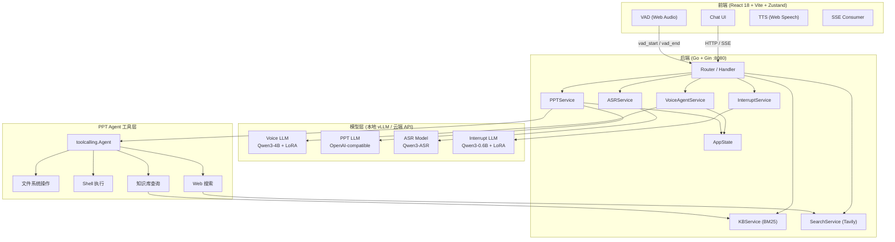
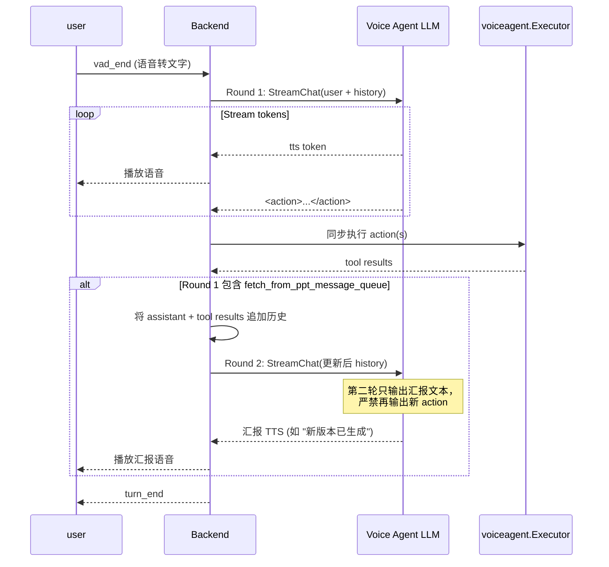
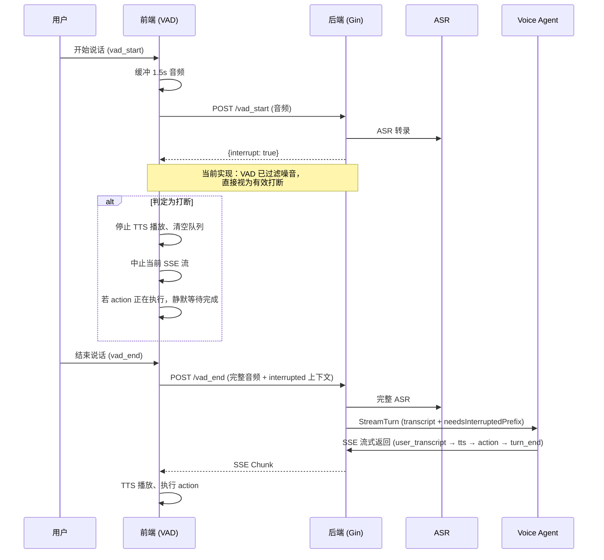

# VoxFlow

<p align="center">
  <b>全双工语音对话驱动的 PPT 生成助手</b><br>
  <i>只需说话，PPT 自动生成 —— 支持实时打断、语音反馈修改与双 Agent 协作</i>
</p>

<p align="center">
  <a href="https://github.com/ZHYsfl/EducationAgent/stargazers"></a>
  <a href="https://github.com/ZHYsfl/EducationAgent/network/members"></a>
  
  
  
  <a href="https://huggingface.co/ZaneSFL/zh-ppt-voice-agent-model-lora-support-interrupt"></a>
  <a href="https://huggingface.co/datasets/ZaneSFL/zh-ppt-voice-agent-interrupt-dialogues"></a>
</p>

---

## 效果演示

> **典型交互流程**：用户对 VoxFlow 说 "我想做一个 Python 入门的 PPT" → Voice Agent 连续确认主题、风格、页数、受众 → PPT Agent 在后台生成 Slidev Markdown 并导出 PDF → 用户语音反馈 "第三页是空的，排版被遮挡了" → PPT Agent 自动修复并重新生成。

### 系统架构



---

## 核心特性

- **全双工语音交互** —— 浏览器端 VAD + TTS，边说边听，端到端延迟极低
- **实时打断与上下文恢复** —— 1.5s 音频预检判断是否为真实打断，支持 `</interrupted>` 标签与截断文本回传，对话流畅不丢失上下文
- **智能 PPT 生成** —— 基于 [Slidev](https://sli.dev/) 将 Markdown 实时转化为精美 PDF/PPT，支持主题定制与代码高亮
- **语音反馈修改** —— 无需打字，直接语音描述问题（如 "这页太空了"、"代码太多"），PPT Agent 自动调整并重新生成
- **双 Agent 深度协作** —— Voice Agent 负责对话与意图理解，PPT Agent 负责工具执行与文件操作，分工明确、高效协同
- **单卡可跑全链路** —— 训练（SFT）与推理全部在单张 RTX 4090 24GB 完成，门槛低、复现易
- **开源全链路** —— 代码、数据集、模型权重、知识库全部开源

---

## 系统架构

VoxFlow 采用 **双 Agent + 前后端分离** 架构：

| 层级 | 技术选型 | 职责 |
|------|---------|------|
| **前端** | React 18 + TypeScript + Vite + Zustand | 麦克风采集、VAD、TTS 播放、SSE 流式消费、对话 UI |
| **后端** | Go 1.23 + Gin | HTTP API、SSE 推送、业务编排、状态管理 |
| **Voice Agent** | Qwen3-4B-Instruct-2507 + QLoRA (本地 vLLM) | 语音对话、需求收集、PPT Agent 沟通桥梁 |
| **PPT Agent** | SOTA LLM (OpenAI-compatible API，如 MiniMax) | Slidev 生成、文件操作、命令执行、搜索、知识库查询 |
| **ASR** | Qwen3-ASR (本地 vLLM) | 语音转文字 |
| **打断检测** | Qwen3-0.6B + LoRA (本地 vLLM) | 1.5s 快速判断是否为真实用户打断 |
| **知识库** | BM25 + Markdown | 计算机领域核心知识检索 (MySQL / Network / OS / Redis) |

---

## 快速开始

### 环境要求

- **Go** 1.23+
- **Node.js** 18+（前端构建 + Slidev 渲染）
- **Python** 3.10+（训练与推理环境）
- **NVIDIA GPU**：推荐 RTX 4090 24GB（单卡可运行全部模型）
- **Docker**（可选，用于沙箱部署）

### 1. 克隆仓库

```bash
git clone https://github.com/ZHYsfl/EducationAgent.git
cd EducationAgent
```

### 2. 配置环境变量

```bash
cp implementation/.env.example implementation/.env
```

编辑 `implementation/.env`，填入你的本地 vLLM 或云端 API 信息：

```env
# Voice Agent（本地微调模型）
VOICE_LLM_BASE_URL=http://127.0.0.1:8001/v1
VOICE_LLM_MODEL=voice-agent
VOICE_LLM_API_KEY=dummy

# 打断检测（本地小模型）
INTERRUPT_LLM_BASE_URL=http://127.0.0.1:8000/v1
INTERRUPT_LLM_MODEL=interrupt-detection
INTERRUPT_LLM_API_KEY=dummy

# PPT Agent / 搜索摘要（云端 SOTA 模型）
OPENAI_BASE_URL=https://api.minimax.chat/v1
OPENAI_MODEL=MiniMax-Text-01
OPENAI_API_KEY=sk-your-key

# ASR（本地模型）
ASR_OPENAI_BASE_URL=http://127.0.0.1:8002/v1
ASR_MODEL_ID=/root/autodl-tmp/asr
ASR_API_KEY=EMPTY

# 网页搜索（可选）
SEARCH_API_URL=
TAVILY_API_KEY=tvly-your-key
```

### 3. 启动后端

```bash
cd implementation
go mod download
go run ./server
# 服务默认监听 :8080
```

### 4. 启动前端

```bash
cd implementation/frontend
npm install
npm run dev
# 默认 http://localhost:5173
```

### 5. 启动本地模型服务（vLLM 示例）

```bash
# Voice Agent
vllm serve /path/to/voice-agent-lora \
  --enable-lora --port 8001

# Interrupt Detection
vllm serve /path/to/interrupt-detection-lora \
  --enable-lora --port 8000

# ASR
vllm serve /path/to/asr-model --port 8002
```

> 模型权重下载见下方「开源生态」章节。

---

## 项目结构

```
EducationAgent/
├── implementation/                 # 主实现（Go 后端 + React 前端）
│   ├── frontend/                   # React 18 + Vite + Zustand SPA
│   │   ├── src/components/         # Chat, ConfirmTable, PPTAgentPanel
│   │   ├── src/hooks/              # useConversation, useSSE
│   │   ├── src/audio/              # VAD, Recorder, TTS
│   │   └── src/store/              # Zustand conversation store
│   ├── internal/
│   │   ├── handler/                # Gin HTTP / SSE 路由处理
│   │   ├── service/                # 业务逻辑层
│   │   │   ├── voice_agent_service.go   # Voice Agent 编排（两轮推理）
│   │   │   ├── ppt_service.go           # PPT Agent 运行时与工具注册
│   │   │   ├── interrupt_service.go     # 打断检测
│   │   │   ├── asr_service.go           # 语音识别
│   │   │   ├── kb_service.go            # BM25 知识库检索
│   │   │   └── search_service.go        # Tavily 网页搜索
│   │   ├── state/                  # AppState + PPTAgentRuntime 生命周期
│   │   ├── toolcalling/            # LLM Agent 框架（嵌入版）
│   │   ├── voiceagent/             # <action> 标签解析与执行
│   │   └── tools/                  # 文件与命令底层工具
│   ├── server/                     # 入口 main.go
│   ├── train/                      # SFT 训练脚本
│   │   └── sft_train.py            # Unsloth + QLoRA 微调
│   ├── data/                       # 计算机领域知识库
│   │   ├── mysql/                  # MySQL 核心知识点
│   │   ├── network/                # 计算机网络
│   │   ├── os/                     # 操作系统
│   │   └── redis/                  # Redis
│   ├── workspace/                  # PPT Agent 工作区 + Slidev Skills
│   │   └── skills/slidev/SKILL.md  # 面向 Agent 的 Slidev 速查手册
│   └── docs/                       # 内部技术文档
│       ├── voice_agent_protocol.md       # 协议规范（SSE / 两轮推理 / 打断）
│       └── voice_agent_dataset_guide.md  # SFT 数据集构建指南
├── tool_calling_go/                # 独立 Go SDK（可单独使用）
│   ├── agent.go                    # Agent：自动工具调用循环 + 流式
│   ├── batch.go                    # Batch：信号量并发
│   ├── race.go                     # BatchRace：竞速 + 级联终止
│   ├── orchestrator.go             # 高层编排封装
│   └── example/                    # 使用示例
└── pic/                            # 数据集与实验报告
    ├── interrupt_detection_cot_train.jsonl
    ├── interrupt_detection_cot_val.jsonl
    └── interrupt_detection_cot_test.jsonl
```

---

## 技术深度解析

### Voice Agent 两轮推理（Two-Round Inference）

Voice Agent 并非单次输出完即结束，而是采用条件触发的两轮推理：



- **Round 1**：模型流式输出 TTS 文本 + `<action>...</action>` 动作标签。Action 被同步执行，结果以独立 `tool` 消息暂存。
- **Round 2（条件触发）**：仅当 Round 1 包含 `fetch_from_ppt_message_queue` 时触发。后端将 tool 结果追加到历史，发起第二次 `StreamChat`，模型只输出汇报文本，**严禁再产生新 action**。

这种设计确保：用户始终先听到语音反馈，PPT Agent 的异步结果在完成后通过第二轮自然汇报，不打断对话节奏。

> 详细协议见 [`implementation/docs/voice_agent_protocol.md`](implementation/docs/voice_agent_protocol.md)。

### 实时打断机制

VoxFlow 实现了低延迟的全双工打断，核心流程如下：



1. **VAD 检测**：前端通过 Web Audio API 进行能量检测，过滤静音与噪音，确认有效语音后触发。
2. **打断响应**：前端立即停止 TTS、中止 SSE 流；若后端已输出 `<action` 标签，则静默等待 action 序列完整执行（用户无感知）。
3. **上下文恢复**：通过 `</interrupted>` 标记与 `interrupted_assistant_text` 精确恢复截断前的对话状态，确保 LLM 历史一致性。

### PPT Agent 工具链

PPT Agent 注册约 10 个工具，覆盖完整的 PPT 制作闭环：

| 工具 | 用途 |
|------|------|
| `write_file` / `edit_file` | 写入或修改 Slidev Markdown |
| `execute_command` | 执行 shell 命令（Slidev 导出、npm 安装等） |
| `send_to_voice_agent` | 向 Voice Agent 发送消息（如"PPT 已生成"） |
| `fetch_from_voice_message_queue` | 拉取用户的语音反馈 |
| `query_chunks` | 查询本地计算机知识库 |
| `search_web` | Tavily 网页搜索 |
| `read_file` | 读取文件内容 |

### 历史压缩

当 PPT Agent 对话历史 token 预估超过 100k 时，系统自动对旧轮次进行摘要，压缩为单条 user 消息，同时保留 tool-call 对齐关系，防止长上下文溢出。

---

## 训练与复现

### Voice Agent 微调

我们使用 **Unsloth + QLoRA** 对 Qwen3-4B-Instruct-2507 进行 SFT：

| 配置 | 值 |
|------|-----|
| 基座模型 | Qwen3-4B-Instruct-2507 |
| 微调方法 | QLoRA (4-bit) |
| LoRA 参数 | r=8, alpha=16, target_modules=all attention + MLP |
| 训练轮数 | 3 epochs |
| 学习率 | 2e-4 |
| 序列长度 | 1536 |
| 有效 Batch | 8 (per_device=1, accumulation=8) |
| 硬件 | 单张 RTX 4090 24GB |

```bash
cd implementation/train
python sft_train.py
```

数据集为 6000+ 条 `final.jsonl`（OpenAI messages 格式），覆盖 Phase 1（需求收集）与 Phase 2（反馈沟通）的全流程对话，包含正常流与打断流。

- **模型权重**：[ZaneSFL/zh-ppt-voice-agent-model-lora-support-interrupt](https://huggingface.co/ZaneSFL/zh-ppt-voice-agent-model-lora-support-interrupt)
- **数据集**：[ZaneSFL/zh-ppt-voice-agent-interrupt-dialogues](https://huggingface.co/datasets/ZaneSFL/zh-ppt-voice-agent-interrupt-dialogues)

### 打断检测微调

| 配置 | 值 |
|------|-----|
| 基座模型 | Qwen3-0.6B |
| 微调方法 | LoRA |
| 数据集 | 5000 条（4000 train / 500 val / 500 test）|
| 最佳指标 | Eval Loss 0.4512 @ step 700 |

本地模型位于 `implementation/interrupt_detection_cot_lora/`。

---

## 开源生态

VoxFlow 不是孤立项目，我们围绕它构建了一整套可复用的开源资源：

| 资源 | 说明 | 链接 |
|------|------|------|
| **EducationAgent** | 主仓库（本仓库）：完整前后端 + 训练 + 部署 | [GitHub](https://github.com/ZHYsfl/EducationAgent) |
| **tool_calling_go** | 独立 Go SDK：LLM Agent、批量并发（Batch）、竞速编排（BatchRace）、级联终止 | 本仓库 [`tool_calling_go/`](tool_calling_go/) |
| **zh-ppt-voice-agent-model-lora-support-interrupt** | Voice Agent QLoRA 微调权重，支持打断场景的中文语音助手对话 | [HuggingFace](https://huggingface.co/ZaneSFL/zh-ppt-voice-agent-model-lora-support-interrupt) |
| **zh-ppt-voice-agent-interrupt-dialogues** | 6000+ 条中文语音助手打断对话 SFT 数据集（OpenAI messages 格式） | [HuggingFace Datasets](https://huggingface.co/datasets/ZaneSFL/zh-ppt-voice-agent-interrupt-dialogues) |
| **interrupt_detection_cot_lora** | 打断检测 LoRA 模型与 5000 条标注数据 | 本仓库 [`implementation/interrupt_detection_cot_lora/`](implementation/interrupt_detection_cot_lora/) |
| **CS Knowledge Base** | 计算机领域核心知识库，支撑 PPT 内容生成 | 本仓库 [`implementation/data/`](implementation/data/) |

---

## 文档索引

| 文档 | 内容 |
|------|------|
| [`implementation/api.md`](implementation/api.md) | 完整后端 API 契约（Module 0-4 + 前端职责） |
| [`implementation/docs/voice_agent_protocol.md`](implementation/docs/voice_agent_protocol.md) | Voice Agent 协议规范：两轮推理、SSE Chunk、打断语义 |
| [`implementation/docs/voice_agent_dataset_guide.md`](implementation/docs/voice_agent_dataset_guide.md) | SFT 数据集构建指南：Phase 划分、消息格式、打断规则 |
| [`tool_calling_go/README.md`](tool_calling_go/README.md) | tool_calling_go SDK 双语文档（Agent / Batch / BatchRace / 编排） |

---

## 团队与致谢

VoxFlow 由 **5 人团队**历时数月迭代开发，累计 **400+ commits**。我们从零构建了一套完整的语音交互 PPT 生成系统，并将代码、数据、模型全部开源，希望能为中文语音助手与 Agent 工具调用社区提供有价值的参考。

感谢以下开源项目提供的坚实基础：

- [Qwen](https://github.com/QwenLM/Qwen) —— 强大的中文基座模型
- [Slidev](https://sli.dev/) —— 开发者友好的幻灯片方案
- [Unsloth](https://github.com/unslothai/unsloth) —— 高效的 LLM 微调框架
- [openai-go](https://github.com/openai/openai-go) —— 官方 Go SDK
- [Gin](https://github.com/gin-gonic/gin) —— 高性能 Go Web 框架

---

## License

Apache-2.0
