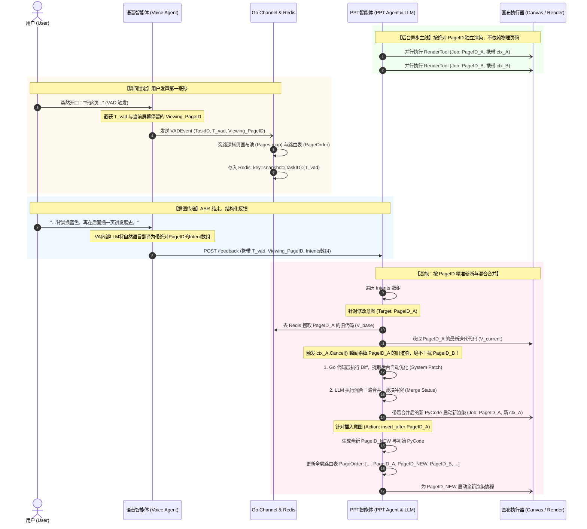
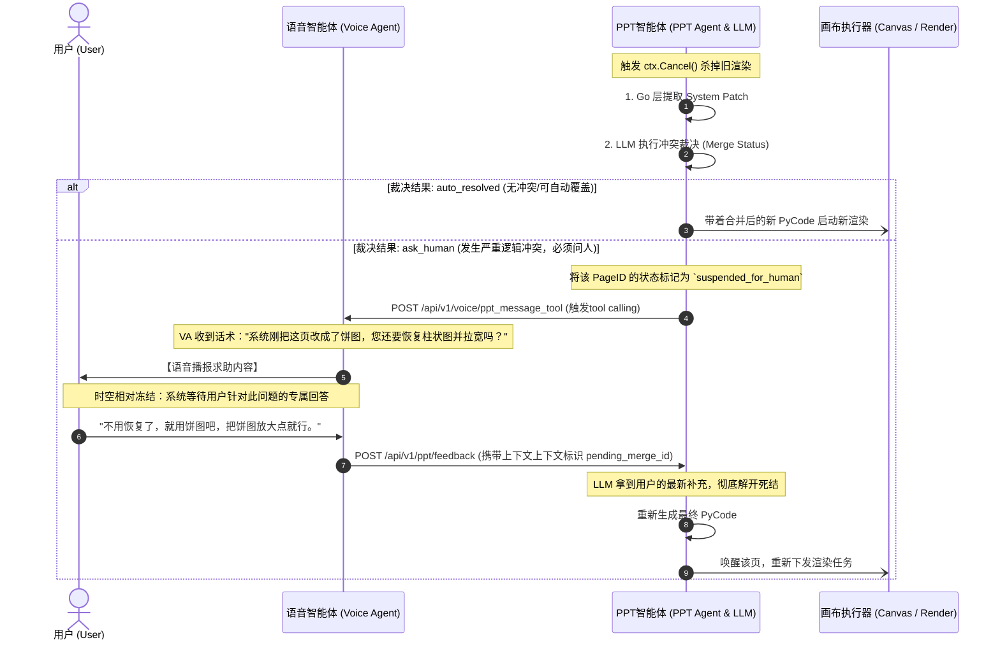

------

### 第一部分：底层状态与内部总线 (Redis & Go Channels)

这是系统高并发不出错的根基，抛弃了物理页码，彻底使用 `PageID`（UUID）解耦。

#### 1. VAD 极速触发信号 (Go Channel Event)

当用户发声的第一毫秒，Voice Agent 丢入系统总线的轻量级信号，触发 Redis 瞬间深拷贝。

```go
// 内部 Channel：VADSignalChan <- VADEvent
type VADEvent struct {
    TaskID        string `json:"task_id"`
    Timestamp     int64  `json:"timestamp"`        // T_vad: 用户开口的绝对毫秒时间戳
    ViewingPageID string `json:"viewing_page_id"`  // 瞬间锁定：用户开口时屏幕正停留的绝对页面 ID
}
```

> **注意：`ViewingPageID` 仅为消歧义元数据**（用户说"这页"时指的哪一页），**不代表快照范围**。收到 `VADEvent` 后，PPT Agent 必须对该 `TaskID` 的**整个画布**（全部 `Pages map` + `PageOrder`）做深拷贝，而非只保存 `ViewingPageID` 对应的那一页。详见 §2 `CanvasSnapshot` 的完整结构。

> **分进程部署时**：Voice Agent 不经过本进程 `VADSignalChan`，而是通过 HTTP **`POST /api/v1/canvas/vad-event`** 将同一结构投递给 PPT Agent，见下文 **第二部分 §4**。

#### 2. 全局画布快照树 (Redis Model)

**Redis Key**: `snapshot:{task_id}:{timestamp}` (TTL 建议设为 300 秒)

```go
type CanvasSnapshot struct {
    TaskID    string              `json:"task_id"`
    Timestamp int64               `json:"timestamp"`  // 对应 VADEvent 的 T_vad
    PageOrder []string            `json:"page_order"` // 核心路由表：维护物理渲染顺序，如 ["uuid_A", "uuid_B", "uuid_NEW"]
    Pages     map[string]PageCode `json:"pages"`      // 扁平化数据池：Key 必须是绝对唯一的 PageID
}

type PageCode struct {
    PageID string `json:"page_id"`
    PyCode string `json:"py_code"`
    Status string `json:"status"` // rendering (渲染中), completed (完成), failed (失败), suspended_for_human (挂起等待人类回答)
}
```

------

### 第二部分：外部核心通信接口 (Voice Agent ↔ PPT Agent)

这是两个 Agent 之间通过 HTTP 或 RPC 通信的“外网”协议。

#### 3. 任务初始化接口 (Init Task)

- **API 路径**: `POST /api/v1/ppt/init`
- **请求体 (Request JSON)**:

```json
{
  "user_id": "u_9527",
  "topic": "多智能体协作机制",
  "description": "第一部分讲RAG，第二部分讲强化学习，重点突出架构图的演进过程。",
  "total_pages": 10,
  "audience": "技术开发人员",
  "global_style": "科技风，暗黑背景"
}
```

- **响应体 (Response JSON)**:

```json
{
  "code": 200,
  "data": {
    "task_id": "task_abc123"
  }
}
```

#### 4. VAD 极速触发 HTTP 接口（Voice Agent → PPT Agent）

第一部分 **§1** 描述的是 `VADSignalChan` + Redis 的**逻辑语义**。当 **Voice Agent 与 PPT Agent 分进程部署**时，不在同一进程内共享 Channel，必须由 Voice Agent 通过 **HTTP** 把等价的 `VADEvent` 投递给 PPT Agent；PPT Agent 收到后执行与第一部分相同的处理：**对该 `task_id` 的整个画布做深拷贝**（全部 `Pages map` + `PageOrder`，而非只保存 `viewing_page_id` 那一页），写入 Redis：`snapshot:{task_id}:{timestamp}`（TTL 见 §2）。`viewing_page_id` 仅用于后续 `POST /feedback` 时消歧义「用户说'这页'指的是哪一页」，不影响快照范围。

**调用约定：**

- **调用方**：Voice Agent（用户前端上报 `vad_start`、且当前会话已有活跃 `task_id` 时；无任务则不调用）。
- **实现方**：PPT Agent（与 `负责接口.md`、系统规范 §3.1.1 对齐）。
- **不得阻塞**：建议异步 `POST`，不阻塞 ASR/语音主线程。

- **API 路径**: `POST /api/v1/canvas/vad-event`
- **请求体 (Request JSON)**：与第一部分 `VADEvent` 字段一致。

```json
{
  "task_id": "task_abc123",
  "timestamp": 1710680000123,
  "viewing_page_id": "uuid_of_page_A"
}
```

- **响应体 (Response JSON)**（与项目统一 `code/message/data` 约定一致即可，成功示例）：

```json
{
  "code": 200,
  "message": "success",
  "data": {
    "accepted": true
  }
}
```

> **与后续 `POST /api/v1/ppt/feedback` 的关系**：`feedback` 请求体中的 `base_timestamp` / `viewing_page_id` 应对齐本轮或最近一次 VAD 锚定的时间与页面（见系统规范对 `base_timestamp` 的说明）。

#### 5. 结构化反馈与意图下发接口 (Submit Feedback)

ASR 识别完成，Voice Agent 内部 LLM 完成自然语言降维后，向 PPT Agent 发起精准打击。支持处理正常反馈和“解开挂起死结”的追问回复。

- **API 路径**: `POST /api/v1/ppt/feedback`
- **请求体 (Request JSON)**:

```json
{
  "task_id": "task_abc123",
  "base_timestamp": 1710680000, 
  "viewing_page_id": "uuid_of_page_A", 
  "reply_to_context_id": "",                 // 如果是回答 Agent 之前的提问，填入对应的 context_id
  "raw_text": "这页背景换成蓝色，然后在后面加一页关于发展史的。",
  "intents": [
    {
      "action_type": "modify",               // 枚举: modify, insert_before, insert_after, delete, global_modify, resolve_conflict
      "target_page_id": "uuid_of_page_A",    // 绝对 ID。若 action_type 为 global_modify，此处填 "ALL"
      "instruction": "背景颜色更改为蓝色"
    },
    {
      "action_type": "insert_after",
      "target_page_id": "uuid_of_page_A",
      "instruction": "创建新页面，内容为发展史的详细介绍"
    }
  ]
}
```

#### 6. 反向求助/语音播报接口 (PPT Agent 调 Voice Agent)

当大模型合并发生严重冲突，PPT Agent 挂起当前任务，反向调用 Voice Agent 发声求助。

- **API 路径**: `POST /api/v1/voice/ppt_message_tool`
- **请求体 (Request JSON)**:

```json
{
  "task_id": "task_abc123",
  "page_id": "uuid_of_page_A",
  "priority": "high",                        // tool
  "context_id": "merge_conflict_001",        // 抛给用户的上下文线索，用户回答后必须原样带回
  "tts_text": "系统刚刚优化了这页的排版，换成了饼图。您确定要撤销并改回柱状图吗？"
}
```

#### 7. 前端大屏状态轮询接口 (Get Status)

前端用于拉取最新画面，或者 Voice Agent 用来偷瞄当前屏幕状态。

- **API 路径**: `GET /api/v1/canvas/status?task_id=task_abc123`
- **响应体 (Response JSON)**:

```json
{
  "code": 200,
  "data": {
    "task_id": "task_abc123",
    "page_order": ["uuid_1", "uuid_A", "uuid_NEW", "uuid_2"], 
    "current_viewing_page_id": "uuid_A",
    "pages_info": [
      {
        "page_id": "uuid_A",
        "status": "completed",
        "last_update": 1710680050,
        "render_url": "https://cdn.../page_A_v5.png"
      }
    ]
  }
}
```

------

### 第三部分：内部智能调度与执行器 (LLM & Render Workers)

这里是 PPT Agent 内部最核心的工作流，对外部完全不可见。

#### 8. 混合三路合并载荷 (Three-Way Merge Payload)

组装给内部 LLM 执行智能 Diff 和冲突裁决的结构。

**无冲突（Auto-Resolve）**：如果用户的 `Instruction`（比如“改背景色”）与 `SystemPatch`（比如“修改了文字字号”）在语义和代码行上毫无交集，大模型直接在 `CurrentCode` 上改好颜色，返回最终代码。

**严重冲突（Ask Human）**：如果 `SystemPatch` 显示刚刚删除了一个柱状图换成了饼图，而用户的 `Instruction` 却是“把那个柱状图拉宽一点”。大模型瞬间警觉：撞车了！此时放弃修改代码，直接返回 `ask_human` 状态，并生成一句反向求助的话术发给 Voice Agent。

在咱们的 PPT 智能体架构里，这“三路”分别代表：

- **第一路：共同祖先（Common Ancestor / Base）** 对应我们系统里的 **`V_base`**。这是你在 VAD 触发那毫秒瞬间拍下的快照。它是系统偷偷优化和用户提出修改的“共同起点”。
- **第二路：系统的演进分支（System Branch / Current）** 对应底层的 **`V_current`**。这是系统在你不说话的这几十秒里，在后台默默跑出的新版本（比如它自己把字体调大了）。
- **第三路：用户的意图分支（User Branch / Feedback）** 对应你的自然语言 **`Instruction`**。这是你基于共同祖先（你当时看到的画面）想要修改的方向（比如你想改背景颜色）。

### 为什么必须是“三路”才能解决冲突？

假设我们不用三路合并，只用“两路”（只拿最新的 `V_current` 和你的意见 `Instruction` 给大模型）： 大模型看着一份完全陌生的最新代码，然后你告诉它“改成蓝色”。它根本不知道这份代码里哪些是你原来就确认好的，哪些是系统刚刚背着你乱改的。它很容易把系统刚做好的精美排版给搞砸。

**引入“共同祖先（第一路）”后，大模型（或者 Git）的裁决逻辑就变得极其清晰：**

1. 大模型对比 Base 和 Current，发现：**“哦，系统基于祖先，修改了第 10 行的字体大小。”**
2. 大模型看你的 Instruction，发现：**“哦，用户基于祖先，想修改第 20 行的背景颜色。”**
3. **三路裁决结果**：第 10 行和第 20 行互不干涉！大模型保留系统的字体优化，同时把你的背景色加上，产出完美代码。
4. **触发求助（Ask Human）**：如果大模型发现系统改了第 10 行的图表类型，而你刚好要求把第 10 行的图表拉宽，这就撞车了！系统就会老老实实挂起任务问你。

```go
type ThreeWayMergeTask struct {
    TaskID      string `json:"task_id"`
    PageID      string `json:"page_id"`
    CurrentCode string `json:"current_code"` // 核心基底：系统最新迭代的代码 (V_current)，大模型将直接基于它进行修改
    SystemPatch string `json:"system_patch"` // 防撞高亮：Go 层算出的 (V_base -> V_current) 代码差异，告诉大模型系统刚才偷偷动了哪
    Instruction string `json:"instruction"`  // 核心变量：用户具体的修改意见 (自然语言)
}
```

#### 9. LLM 冲突裁决输出 (Merge Result JSON)

大模型思考后返回的结构化结果，决定协程是继续跑还是挂起。

```go
type MergeResult struct {
    PageID          string `json:"page_id"`
    MergeStatus     string `json:"merge_status"`      // 枚举: auto_resolved (搞定，可覆写), ask_human (死结，需问人)
    MergedPyCode    string `json:"merged_pycode"`     // 仅 auto_resolved 时有值：全新的 Python 源码
    QuestionForUser string `json:"question_for_user"` // 仅 ask_human 时有值：发送给 TTS 的求助话术
}
```

#### 10. 底层渲染执行器 (Canvas Renderer Worker)

并发画图的苦力，只认代码和指令，通过 Context 控制生杀大权。

```go
type RenderJob struct {
    TaskID string
    PageID string // 不再传入物理页码，彻底解耦
    PyCode string
}

type RenderResponse struct {
    Success bool
    Error   string // 如果代码跑崩了，返回 Traceback 给大模型修复
}

type CanvasRenderer interface {
    // 灵魂所在：必须监听 <-ctx.Done()。
    // 如果 PPT Agent 在外部调用了 ctx.Cancel()，这里立即终止 Python 进程释放算力！
    Execute(ctx context.Context, job RenderJob) RenderResponse
}
```


* 给用户看一页，get xxx
* 大模型渲染验证

* task_id 一个PPT


* 代码不冲突->逻辑不冲突 不经过大模型
* 代码冲突，逻辑冲突 三路合并，冲突，问人
* 代码冲突，逻辑不冲突 三路合并，不冲突，大模型继续


* 一页一旦悬挂，如果用户给的新反馈也是这页，但和悬挂的理由没关系，把用户新的反馈记录下来，同时不能解开悬挂，必须再次发送和悬挂理由该如何让用户做的反问给Voice agent,优先级还是高。
* 如果悬挂时长超过45s，应当再次重复问用户一遍。如果悬挂时长超过3分钟用户还是不给悬挂原因的反馈，大模型直接自己决策。
* 一定要想好各种时序情形，三路合并那该如何处理。比如大模型正在三路合并running,那一页又来了个用户反馈，这时候应该怎么办，你来保证时序正确性。
