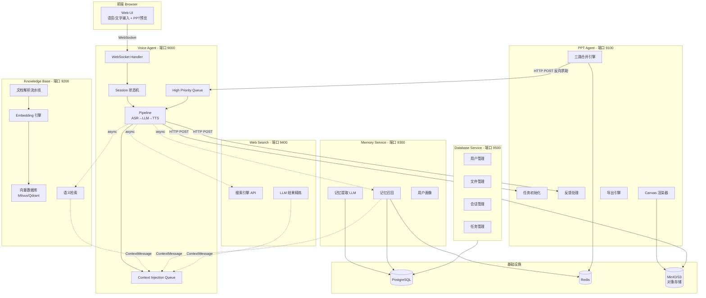

# 多模态 AI 教学智能体 — 全系统接口规范 v1.0

> **文档性质**：本文档是所有模块间通信的"法律"依据。任何模块的实现必须严格遵守本文档定义的数据结构、HTTP API 签名、时序约束和错误码。若实现与本文档冲突，以本文档为准。  
> **编程语言**：Go（全系统统一）  
> **最后更新**：2026-03-19

---

## 目录

- [第 0 章 全局约定](#第-0-章-全局约定)
- [第 1 章 异步消息总线 — Context Injection Queue](#第-1-章-异步消息总线--context-injection-queue)
- [第 1.5 章 Interactive ReAct 协议](#第-15-章-interactive-react-协议)
- [第 2 章 Voice Agent ↔ Frontend](#第-2-章-voice-agent--frontend)
- [第 3 章 Voice Agent ↔ PPT Agent](#第-3-章-voice-agent--ppt-agent)
- [第 4 章 Knowledge Base Service](#第-4-章-knowledge-base-service)
- [第 5 章 Memory Service](#第-5-章-memory-service)
- [第 6 章 Web Search Service](#第-6-章-web-search-service)
- [第 7 章 Database Service](#第-7-章-database-service)
- [第 8 章 参考资料处理流水线](#第-8-章-参考资料处理流水线)
- [附录 A 团队分工](#附录-a-团队分工)
- [附录 B 系统架构图](#附录-b-系统架构图)

---

## 第 0 章 全局约定

本章定义所有模块必须遵守的基础约定，任何章节如无特殊说明均继承此处规则。

### 0.1 统一响应格式

所有 HTTP JSON 接口响应采用以下统一包装（推荐三段式；内部简化场景可省略 `message`）：

```go
type APIResponse struct {
    Code    int             `json:"code"`              // 业务状态码，200 表示成功
    Message string          `json:"message,omitempty"` // 人类可读的状态描述（可选）
    Data    json.RawMessage `json:"data,omitempty"`    // 业务数据，失败时可为空
}
```

**成功示例：**

```json
{
  "code": 200,
  "message": "success",
  "data": { "task_id": "task_abc123" }
}
```

**失败示例：**

```json
{
  "code": 40001,
  "message": "参数 topic 不能为空",
  "data": null
}
```

### 0.2 统一错误码体系


| 范围            | 类别      | 说明                           |
| ------------- | ------- | ---------------------------- |
| `200`         | 成功      | 请求正常完成                       |
| `40001-40099` | 参数错误    | 缺少必填字段、类型不匹配、格式非法            |
| `40100-40199` | 认证/鉴权   | Token 过期、无权限                 |
| `40400-40499` | 资源不存在   | 目标实体不存在                      |
| `40900-40999` | 冲突      | 资源状态冲突（如重复创建、悬挂中不可操作）        |
| `50000-50099` | 服务内部错误  | 未预期的异常                       |
| `50200-50299` | 依赖服务不可用 | LLM / Redis / 向量数据库 等下游超时或崩溃 |


各模块在上述范围内自行分配具体编号，但不得跨范围使用。

### 0.3 认证方式

- 所有外部 HTTP 请求（前端 → 后端）携带 JWT：`Authorization: Bearer <token>`
- 模块间内部 HTTP 调用（如 Voice Agent → PPT Agent）携带共享密钥：`X-Internal-Key: <key>`
- WebSocket 连接在 URL query 参数中传递 token：`/ws?token=<jwt>`

```go
type JWTClaims struct {
    UserID    string `json:"user_id"`
    Username  string `json:"username"`
    ExpiresAt int64  `json:"exp"`
}
```

### 0.4 ID 规范

所有实体 ID 使用 UUID v4 并添加类型前缀，以提升可读性和调试效率：


| 实体     | 前缀        | 示例                    |
| ------ | --------- | --------------------- |
| 用户     | `user_`   | `user_a1b2c3d4-...`   |
| 会话     | `sess_`   | `sess_e5f6g7h8-...`   |
| PPT 任务 | `task_`   | `task_abc123de-...`   |
| PPT 页面 | `page_`   | `page_f9e8d7c6-...`   |
| 文件     | `file_`   | `file_11223344-...`   |
| 知识库集合  | `coll_`   | `coll_aabbccdd-...`   |
| 知识库文档  | `doc_`    | `doc_55667788-...`    |
| 文本块    | `chunk_`  | `chunk_99aabb00-...`  |
| 记忆条目   | `mem_`    | `mem_ccddeeff-...`    |
| 搜索请求   | `search_` | `search_12345678-...` |
| 上下文消息  | `ctx_`    | `ctx_deadbeef-...`    |


生成函数签名：

```go
func NewID(prefix string) string  // 示例: NewID("task_") → "task_a1b2c3d4-e5f6-7890-abcd-ef1234567890"
```

### 0.5 任务判定规则（多 PPT 场景）

一个 `task_id` 对应一份 PPT。同一用户可能同时有多个任务。Voice Agent 必须按以下优先级判定用户语音指向哪个任务：

```text
1. reply_to_context_id 命中 → 用该 context 绑定的 task_id（冲突回复场景）
2. 话里明确提到任务名/编号 → 用匹配的 task_id
3. active_task_id 存在     → 用当前活跃任务（默认值）
4. 只有 1 个可用任务        → 用那个 task_id
5. 以上都不满足             → 追问用户选择，绝不猜
```

**`active_task_id` 维护规则：**

| 事件 | 动作 |
|---|---|
| 用户创建新 PPT（`ppt/init` 成功） | 设为新 `task_id` |
| 前端发 `page_navigate` 切换任务 | 更新为该 `task_id` |
| 用户语音明确切换（"打开那个高数课件"） | LLM 解析后更新 |
| 当前任务进入 `completed` / `failed` | 清空，等待下次指定 |

Session 结构体扩展：

```go
type Session struct {
    // ... 现有字段 ...
    ActiveTaskID string            // 当前活跃任务
    PendingQuestions map[string]string // context_id → task_id 映射
}
```

### 0.6 时间戳

- 所有时间戳字段统一使用 **Unix 毫秒** (`int64`)
- JSON 中的字段名以 `_at` 或 `timestamp` 结尾
- Go 中获取当前毫秒时间戳：`time.Now().UnixMilli()`

### 0.7 HTTP 通用规则

- Content-Type：`application/json`（文件上传除外，使用 `multipart/form-data`）
- 请求方法语义：`POST`=创建/动作, `GET`=查询, `PUT`=全量更新, `PATCH`=部分更新, `DELETE`=删除
- 列表查询支持分页：`?page=1&page_size=20`，响应中包含 `total` 字段
- 所有端口段分配：


| 模块                     | 默认端口 |
| ---------------------- | ---- |
| Voice Agent            | 9000 |
| PPT Agent              | 9100 |
| Knowledge Base Service | 9200 |
| Memory Service         | 9300 |
| Web Search Service     | 9400 |
| Database Service       | 9500 |


---

## 第 1 章 异步消息总线 — Context Injection Queue

### 1.1 设计理念

Voice Agent 是系统的中枢编排者，负责与用户实时对话。为保证用户体验，Voice Agent **永远不阻塞等待**外部模块（Knowledge Base、Web Search、Memory、PPT Agent）的响应。所有对外请求均通过 goroutine 异步发起，结果统一汇入一条 `contextQueue` channel，Voice Agent 在恰当时机读取并注入 LLM 上下文。

这一设计直接来源于 SEAL 架构的"边听边想"思路——LLM 处理速度（100+ tokens/s）远超语音 I/O（5 tokens/s），充分利用间隙时间为 LLM 补充上下文。

### 1.2 核心数据结构

```go
type ContextMessage struct {
    ID         string            `json:"id"`           // 唯一 ID，格式 ctx_<uuid>
    ActionType string            `json:"action_type"`  // 消息来源模块
    Priority   string            `json:"priority"`     // 优先级
    MsgType    string            `json:"msg_type"`     // 消息类型
    Content    string            `json:"content"`      // 注入 LLM 上下文的文本
    Metadata  map[string]string `json:"metadata"`    // 附加元数据
    Timestamp int64             `json:"timestamp"`   // 产生时刻 (Unix ms)
}
```

**ActionType 枚举（action_type 字段）：**


| 值                | 说明                        |
| ---------------- | ------------------------- |
| `knowledge_base` | 来自知识库 RAG 检索结果            |
| `web_search`     | 来自 Web 搜索结果               |
| `memory`         | 来自记忆模块（用户画像 / 历史摘要）       |
| `ppt_agent`      | 来自 PPT Agent（状态更新 / 冲突求助） |


**Priority 枚举与处理规则：**


| 值        | 行为                                                                                           |
| -------- | -------------------------------------------------------------------------------------------- |
| `high`   | 立即处理。若 Voice Agent 正在 Speaking，等待当前句子播报完毕后插入播报；若在 Idle/Listening，直接触发播报。典型场景：PPT Agent 冲突求助。 |
| `normal` | 下次 LLM 调用前注入 system prompt 上下文。典型场景：RAG 检索结果、搜索结果、用户记忆。                                      |
| `low`    | 缓存到本地缓冲池，仅在 Idle 且无待处理消息时才注入。典型场景：后台预加载的知识、PPT 渲染进度通知。                                       |


**MsgType 枚举：**


| 值                   | 说明                    | 典型 Source        |
| ------------------- | --------------------- | ---------------- |
| `rag_chunks`        | RAG 检索命中的知识块          | `knowledge_base` |
| `search_result`     | Web 搜索摘要              | `web_search`     |
| `user_profile`      | 用户画像信息                | `memory`         |
| `memory_recall`     | 相关历史记忆                | `memory`         |
| `ppt_status`        | PPT 任务状态变更通知          | `ppt_agent`      |
| `conflict_question` | PPT Agent 冲突求助，需语音播报  | `ppt_agent`      |
| `tool_result`       | 工具调用结果（兜底类型，仅无法归类时使用） | 任意               |


**MsgType 选型规则（强制）：**

1. **优先使用专用类型**：`rag_chunks`、`search_result`、`user_profile`、`memory_recall`、`ppt_status`、`conflict_question`
2. **仅在无法归类时使用 `tool_result`**：例如新接入工具尚未定义专用 MsgType，或临时调试阶段
3. **本项目推荐做法**：KB 用 `rag_chunks`；Web Search 用 `search_result`；Memory 用 `user_profile` / `memory_recall`；PPT Agent 用 `ppt_status` / `conflict_question`

### 1.3 Voice Agent 内部集成

#### 1.3.1 Pipeline 扩展

在现有 `Pipeline` 结构体中新增以下字段：

```go
type Pipeline struct {
    // ... 现有字段保持不变 ...

    contextQueue    chan ContextMessage      // 统一上下文注入队列，容量 64
    pendingContexts []ContextMessage         // 已 drain 的待注入上下文缓冲
    pendingMu       sync.Mutex

    highPriorityQueue chan ContextMessage     // 高优先级独立通道，容量 16
}
```

#### 1.3.2 上下文 Drain 机制

在 `startProcessing()` 调用 LLM 之前，执行非阻塞 drain：

```go
func (p *Pipeline) drainContextQueue() []ContextMessage {
    var msgs []ContextMessage
    for {
        select {
        case msg := <-p.contextQueue:
            msgs = append(msgs, msg)
        default:
            return msgs
        }
    }
}
```

将 drain 到的消息格式化为 LLM system prompt 附加段：

```go
func FormatContextForLLM(msgs []ContextMessage) string {
    if len(msgs) == 0 {
        return ""
    }
    var sb strings.Builder
    sb.WriteString("\n\n[系统补充信息 - 以下是后台检索到的相关资料，供回答参考]\n")
    for _, m := range msgs {
        sb.WriteString(fmt.Sprintf("\n--- 来源: %s | 类型: %s ---\n%s\n", m.ActionType, m.MsgType, m.Content))
    }
    return sb.String()
}
```

#### 1.3.3 高优先级监听 goroutine

独立 goroutine 监听 `highPriorityQueue`，收到消息后：

1. 若 `MsgType == "conflict_question"`，立即走 TTS 播报流程
2. 将 `Metadata["context_id"]` 记录到 Session 的待回答列表
3. 用户下次发言时，Voice Agent LLM 判断是否在回答该问题，若是则带上 `context_id` 路由给 PPT Agent

```go
func (p *Pipeline) highPriorityListener(ctx context.Context) {
    for {
        select {
        case msg := <-p.highPriorityQueue:
            switch msg.MsgType {
            case "conflict_question":
                ttsText := msg.Content
                p.session.SetState(StateSpeaking)
                sentenceCh := make(chan string, 1)
                sentenceCh <- ttsText
                close(sentenceCh)
                p.ttsWorker(ctx, sentenceCh)
                p.session.SetState(StateIdle)
                p.session.AddPendingQuestion(msg.Metadata["context_id"], msg.Metadata["page_id"])
            default:
                p.pendingMu.Lock()
                p.pendingContexts = append(p.pendingContexts, msg)
                p.pendingMu.Unlock()
            }
        case <-ctx.Done():
            return
        }
    }
}
```

### 1.4 异步请求发射模式

Voice Agent 向外部模块发请求的统一模式——"发射后不管"（fire-and-forget with callback）：

```go
func (p *Pipeline) asyncQuery(
    ctx context.Context,
    source string,
    msgType string, // 推荐传专用类型；为空时自动降级为 tool_result
    queryFn func() (string, error),
) {
    go func() {
        result, err := queryFn()
        if err != nil {
            log.Printf("[ContextBus] %s query failed: %v", source, err)
            return
        }
        if result == "" {
            return
        }
        resolvedType := msgType
        if resolvedType == "" {
            resolvedType = "tool_result"
        }
        msg := ContextMessage{
            ID:         NewID("ctx_"),
            ActionType: source,
            Priority:   "normal",
            MsgType:    resolvedType,
            Content:    result,
            Timestamp: time.Now().UnixMilli(),
        }
        select {
        case p.contextQueue <- msg:
        case <-ctx.Done():
        }
    }()
}
```

调用示例（推荐）：

```go
// 知识库结果
p.asyncQuery(ctx, "knowledge_base", "rag_chunks", queryKB)

// 记忆召回结果
p.asyncQuery(ctx, "memory", "memory_recall", recallMemory)

// Web 搜索结果
p.asyncQuery(ctx, "web_search", "search_result", queryWeb)

// 兜底（仅无法归类时）
p.asyncQuery(ctx, "web_search", "", queryUnknownTool)
```

### 1.5 时序图：异步上下文注入全流程

```
用户说话 ──→ VAD触发 ──→ ASR开始
                │
                ├──→ goroutine: 查知识库(query) ──→ 结果 → contextQueue
                ├──→ goroutine: 查记忆(recall)  ──→ 结果 → contextQueue
                └──→ goroutine: Web搜索(query)  ──→ 结果 → contextQueue
                │
用户说完 ──→ ASR结束 ──→ startProcessing()
                │
                ├──→ drainContextQueue()  ← 非阻塞取出已到达的结果
                ├──→ 拼装 system prompt + 上下文
                └──→ LLM.StreamChat() ──→ TTS 播报
                │
        (此时仍有 goroutine 在跑，结果到了放入 queue，下轮 drain)
```

---

## 第 1.5 章 Interactive ReAct 协议

### 1.5.1 协议概述

Voice Agent 使用自定义文本协议实现 Interactive ReAct 模式，LLM 直接输出协议标记，无需 OpenAI tool calling API。

**协议格式：**
- `@{type|key:value|key:value}` - 异步动作标记
- `#{内容}` - 内部思考标记（可选，不显示给用户）

**示例：**
```
#{用户想做PPT}好的，我来帮您创建。@{ppt_init|topic:AI|desc:人工智能介绍}
```

### 1.5.2 支持的动作类型

| 动作类型 | 格式 | 映射到的接口调用 |
|---------|------|----------------|
| ppt_init | `@{ppt_init\|topic:主题\|desc:描述}` | `POST /api/v1/ppt/init` |
| ppt_mod | `@{ppt_mod\|task:任务ID\|page:页面ID\|action:操作\|ins:指令}` | `POST /api/v1/ppt/feedback` |
| kb_query | `@{kb_query\|q:查询内容}` | `POST /api/v1/kb/query` |

### 1.5.3 执行流程

```
用户输入 → LLM 生成协议标记
    ↓
Parser 流式解析 @{...}
    ↓
Executor 异步执行（goroutine）
    ↓
调用对应的 HTTP 接口
    ↓
结果 → ContextMessage → contextQueue
    ↓
主动推送（session 空闲时触发 LLM）
```

**关键特性：**
- 非阻塞：工具调用不阻塞 LLM 流式输出
- 异步回注：结果通过 ContextQueue 注入下一轮对话
- 主动推送：不等待用户输入，空闲时自动处理结果

---

## 第 2 章 Voice Agent ↔ Frontend

### 2.1 WebSocket 协议（路径 `/ws`）

WebSocket 连接建立后，双向传输文本消息（JSON）和二进制消息（音频）。

#### 2.1.1 现有消息类型（保持不变）

**浏览器 → 服务端：**


| type        | 载荷                       | 说明             |
| ----------- | ------------------------ | -------------- |
| `vad_start` | 无                        | 用户开始说话（VAD 触发） |
| `vad_end`   | 无                        | 用户停止说话         |
| *二进制帧*      | PCM Int16LE, 16kHz, Mono | 实时音频流          |


**服务端 → 浏览器：**


| type               | 载荷               | 说明             |
| ------------------ | ---------------- | -------------- |
| `status`           | `state`: `idle   | listening      |
| `transcript`       | `text`: 部分识别结果   | ASR 流式识别       |
| `transcript_final` | `text`: 最终识别结果   | ASR 2pass 最终结果 |
| `response`         | `text`: LLM 增量输出 | 流式回复           |
| *二进制帧*             | MP3/WAV 音频数据     | TTS 合成音频       |


#### 2.1.2 新增消息类型

**服务端 → 浏览器（新增）：**


| type            | 载荷字段                                             | 说明             |
| --------------- | ------------------------------------------------ | -------------- |
| `task_created`  | `task_id`, `topic`                               | PPT 任务已创建      |
| `task_status`   | `task_id`, `status`, `progress`                  | PPT 任务状态变更     |
| `page_rendered` | `task_id`, `page_id`, `render_url`, `page_index` | 单页渲染完成         |
| `ppt_preview`   | `task_id`, `page_order`, `pages_info[]`          | PPT 整体预览数据     |
| `conflict_ask`  | `task_id`, `page_id`, `context_id`, `question`   | 冲突问题展示（配合语音播报） |
| `export_ready`  | `task_id`, `download_url`, `format`              | 导出文件就绪         |
| `error`         | `code`, `message`                                | 错误通知           |


**浏览器 → 服务端（新增）：**


| type            | 载荷字段                                                              | 说明             |
| --------------- | ----------------------------------------------------------------- | -------------- |
| `text_input`    | `text`                                                            | 文字输入（替代语音）     |
| `page_navigate` | `task_id`, `page_id`                                              | 用户切换查看的页面      |
| `task_init`     | `topic`, `description`, `total_pages`, `audience`, `global_style` | 通过UI表单初始化PPT任务 |


```go
type WSMessage struct {
    Type      string `json:"type"`
    Text      string `json:"text,omitempty"`
    State     string `json:"state,omitempty"`

    // 任务相关
    TaskID    string `json:"task_id,omitempty"`
    Topic     string `json:"topic,omitempty"`
    Status    string `json:"status,omitempty"`
    Progress  int    `json:"progress,omitempty"`       // 0-100

    // 页面相关
    PageID    string `json:"page_id,omitempty"`
    PageIndex int    `json:"page_index,omitempty"`
    RenderURL string `json:"render_url,omitempty"`

    // 预览
    PageOrder []string       `json:"page_order,omitempty"`
    PagesInfo []PageInfoBrief `json:"pages_info,omitempty"`

    // 冲突
    ContextID string `json:"context_id,omitempty"`
    Question  string `json:"question,omitempty"`

    // 导出
    DownloadURL string `json:"download_url,omitempty"`
    Format      string `json:"format,omitempty"`         // "pptx" | "docx"

    // 表单初始化
    Description string `json:"description,omitempty"`
    TotalPages  int    `json:"total_pages,omitempty"`
    Audience    string `json:"audience,omitempty"`
    GlobalStyle string `json:"global_style,omitempty"`

    // 需求收集
    CollectedFields []string          `json:"collected_fields,omitempty"`
    MissingFields   []string          `json:"missing_fields,omitempty"`
    SummaryText     string            `json:"summary_text,omitempty"`
    Requirements    *TaskRequirements `json:"requirements,omitempty"`
    Confirmed       *bool             `json:"confirmed,omitempty"`
    Modifications   string            `json:"modifications,omitempty"`

    // 错误
    Code    int    `json:"code,omitempty"`
    Message string `json:"message,omitempty"`
}

type PageInfoBrief struct {
    PageID     string `json:"page_id"`
    Status     string `json:"status"`
    LastUpdate int64  `json:"last_update"`
    RenderURL  string `json:"render_url"`
}
```

### 2.2 文件上传接口

用于教师上传参考资料（PDF, Word, PPT, 图片, 视频）。

`**POST /api/v1/upload**`

- Content-Type: `multipart/form-data`
- 认证: `Authorization: Bearer <token>`

> 路由说明：`/api/v1/upload` 是 Voice Agent 对前端暴露的网关路由，内部转发到 Database Service 的 `POST /api/v1/files/upload`。前端统一调用本节路由即可。


| 表单字段          | 类型     | 必填  | 说明                                         |
| ------------- | ------ | --- | ------------------------------------------ |
| `file`        | File   | 是   | 上传的文件                                      |
| `session_id`  | string | 是   | 当前会话 ID                                    |
| `task_id`     | string | 否   | 关联的 PPT 任务 ID（如已创建）                        |
| `purpose`     | string | 是   | `reference`(参考资料) / `knowledge_base`(入知识库) |
| `description` | string | 否   | 文件描述（教师对资料用途的说明）                           |


**响应体：**

```json
{
  "code": 200,
  "message": "success",
  "data": {
    "file_id": "file_aabb1122-...",
    "filename": "线性代数教案.pdf",
    "file_type": "pdf",
    "file_size": 2048576,
    "storage_url": "https://oss.example.com/files/file_aabb1122-...",
    "purpose": "reference"
  }
}
```

**文件大小与格式限制：**


| 格式   | 最大尺寸   | MIME Types                                                                  |
| ---- | ------ | --------------------------------------------------------------------------- |
| PDF  | 50 MB  | `application/pdf`                                                           |
| Word | 50 MB  | `application/vnd.openxmlformats-officedocument.wordprocessingml.document`   |
| PPT  | 100 MB | `application/vnd.openxmlformats-officedocument.presentationml.presentation` |
| 图片   | 20 MB  | `image/jpeg`, `image/png`, `image/webp`                                     |
| 视频   | 500 MB | `video/mp4`, `video/webm`                                                   |


### 2.3 PPT 预览接口

**`GET /api/v1/tasks/{task_id}/preview`**

- 认证: `Authorization: Bearer <token>`

**响应体：**

```json
{
  "code": 200,
  "message": "success",
  "data": {
    "task_id": "task_abc123",
    "status": "generating",
    "page_order": ["page_uuid1", "page_uuid2", "page_uuid3"],
    "current_viewing_page_id": "page_uuid1",
    "pages": [
      {
        "page_id": "page_uuid1",
        "status": "completed",
        "last_update": 1710680050000,
        "render_url": "https://cdn.example.com/renders/page_uuid1_v3.png"
      },
      {
        "page_id": "page_uuid2",
        "status": "rendering",
        "last_update": 1710680045000,
        "render_url": ""
      }
    ]
  }
}
```

### 2.4 需求收集对话流程（Requirements Elicitation）

赛题明确要求：*"能主动发起提问以澄清模糊需求，支持多轮对话，并能总结确认最终需求"*。因此在 PPT 生成启动前，Voice Agent 必须与教师完成一轮**结构化需求收集对话**，直到所有必填字段充分填充后，才调用 `POST /api/v1/ppt/init` 启动生成。

#### 2.4.1 需求收集数据结构

Voice Agent 在 Session 层维护一个 `TaskRequirements` 结构体，随对话逐步填充：

```go
type TaskRequirements struct {
    SessionID string `json:"session_id"`
    UserID    string `json:"user_id"`

    // ── 必填项（LLM 必须追问直到获取） ──
    Topic           string   `json:"topic"`             // 课程主题
    KnowledgePoints []string `json:"knowledge_points"`  // 核心知识点清单
    TeachingGoals   []string `json:"teaching_goals"`    // 教学目标
    TeachingLogic   string   `json:"teaching_logic"`    // 讲授逻辑 / 大纲
    TargetAudience  string   `json:"target_audience"`   // 目标受众（年级、专业水平）

    // ── 可选项（LLM 可主动询问，但教师可跳过） ──
    KeyDifficulties []string `json:"key_difficulties"`  // 重点难点
    Duration        string   `json:"duration"`          // 课程时长
    TotalPages      int      `json:"total_pages"`       // 期望页数，0 = Agent 自行决定
    GlobalStyle     string   `json:"global_style"`      // 全局风格（科技风、简约风...）
    InteractionDesign string `json:"interaction_design"` // 互动设计思路（小游戏、动画...）
    OutputFormats   []string `json:"output_formats"`    // 期望产出 ["pptx", "docx", "html5"]
    AdditionalNotes string   `json:"additional_notes"`  // 其他补充要求

    // ── 参考资料（对话中或上传获得） ──
    ReferenceFiles  []ReferenceFileReq `json:"reference_files"`

    // ── 元信息 ──
    CollectedFields []string `json:"collected_fields"`  // 已收集的字段名列表
    Status          string   `json:"status"`            // collecting | ready
    CreatedAt       int64    `json:"created_at"`
    UpdatedAt       int64    `json:"updated_at"`
}

type ReferenceFileReq struct {
    FileID      string `json:"file_id"`
    FileURL     string `json:"file_url"`
    FileType    string `json:"file_type"`
    Instruction string `json:"instruction"` // 教师说的：参照这个PDF的哪部分、仿照什么格式
}
```

#### 2.4.2 收集流程状态机

```
用户: "帮我做一个PPT"
    │
    ▼
┌─────────────────────────────────────────────┐
│ Status: collecting                          │
│                                             │
│ LLM 系统行为:                                │
│  1. 查 Memory Service 预填已知偏好           │
│  2. 按 Checklist 逐项追问缺失字段            │
│  3. 每轮对话后更新 TaskRequirements          │
│  4. 允许教师一次回答多个问题                  │
│  5. 允许教师上传参考资料并说明用途            │
│                                             │
│ 退出条件: 所有必填项已填充                    │
└─────────────┬───────────────────────────────┘
              │ 必填项全部就绪
              ▼
┌─────────────────────────────────────────────┐
│ Status: ready                               │
│                                             │
│ LLM 行为:                                    │
│  生成结构化需求摘要，语音播报给教师确认           │
│  "我整理一下您的需求：主题是...知识点包括..."     │
│  "您看这样理解对吗？有需要调整的地方吗？"         │
│                                             │
│ 分支:                                        │
│  ├─ 教师说"可以/没问题" → LLM 调用 @{ppt_init|...} │
│  └─ 教师提出修改 → 回到 collecting 修正字段     │
└─────────────┬───────────────────────────────┘
              │ 教师确认，LLM 调用 ppt_init
              ▼
┌─────────────────────────────────────────────┐
│ PPT 生成中                                   │
│                                             │
│ 1. 将 TaskRequirements 组装为详细 description │
│ 2. 调用 POST /api/v1/ppt/init               │
│ 3. WebSocket 推送 task_created 给前端        │
│ 4. Voice Agent 语音告知"好的，开始为您生成"     │
└─────────────────────────────────────────────┘
```

#### 2.4.3 LLM 追问 Checklist

Voice Agent 的 LLM 在需求收集阶段使用专用 System Prompt，内嵌以下 Checklist。LLM 根据 `CollectedFields` 判断哪些还未收集，**主动但不生硬地**融入对话追问：


| 优先级 | 字段                   | 追问话术示例                            |
| --- | -------------------- | --------------------------------- |
| P0  | `topic`              | "您想做哪个主题的课件呢？"                    |
| P0  | `knowledge_points`   | "这节课主要涉及哪些知识点？"                   |
| P0  | `teaching_goals`     | "这节课的教学目标是什么？希望学生掌握到什么程度？"        |
| P0  | `teaching_logic`     | "您打算按什么顺序讲？可以大概说一下讲课的思路吗？"        |
| P0  | `target_audience`    | "这是给什么层次的学生讲的？大几的？专业基础如何？"        |
| P0  | `subject`            | "是哪个学科的课件？"                       |
| P0  | `key_difficulties`   | "有哪些重点难点需要特别强调的吗？"                |
| P0  | `duration`           | "这节课大概多长时间？"                      |
| P0  | `global_style`       | "课件风格有什么偏好吗？比如科技风、简约风、学术风？"       |
| P0  | `interaction_design` | "需要设计一些互动环节吗？比如课堂小测验、小游戏之类的？"     |
| P0  | `total_pages`        | "您希望大概多少页？还是我根据内容量自动安排？"          |
| P0  | `output_formats`     | "需要导出为哪种格式？默认 pptx。"              |
| P1  | `reference_files`    | "有参考资料需要上传吗？比如以前的教案、参考PPT、教材PDF？" |
| P1  | `additional_notes`   | "还有其他特殊要求吗？"                      |


**追问策略：**

- 每轮最多追问 **1-2 个** 问题，不要一次性轰炸
- 如果教师一句话就涵盖了多个字段，LLM 应一次性提取
- Memory Service 已有的用户偏好（如 `teaching_style`、`visual_preferences`）直接预填，不再追问
- P1/P2 字段如果教师说"你看着办"或"都行"，标记为已收集（使用默认值）
- 若教师表现出不耐烦或催促，允许跳过剩余 P1/P2 字段直接进入确认

#### 2.4.4 需求收集阶段的 System Prompt 模板

```
你是一位专业的教学助手，正在帮助教师设计课件。你需要通过对话收集以下信息来制作高质量的PPT课件。

【已收集的信息】
{{range .CollectedFields}}
- {{.FieldName}}: {{.Value}}
{{end}}

【待收集信息 Checklist】
{{range .MissingFields}}
- [待收集] {{.FieldName}}: {{.Description}}
{{end}}

【用户画像（来自记忆模块）】
{{.UserProfile}}

【行为准则】
1. 自然地融入对话，不要机械地逐条追问
2. 每轮最多问1-2个问题
3. 如果教师一句话涵盖了多个信息，全部提取
4. 教师上传文件时，主动询问"这份资料您希望我怎么用？是参照里面的内容、还是仿照它的格式？"
5. 所有P0必填项收集完毕后，生成一份结构化摘要让教师确认（发送 `requirements_summary` WS 消息）
6. 教师确认后，LLM 直接调用 `@{ppt_init|topic:...|desc:...}` 工具开始制作PPT
```

#### 2.4.5 TaskRequirements → PPT Init 请求的映射

当教师确认需求后，Voice Agent 将 `TaskRequirements` 组装为 `PPTInitRequest`：

```go
func (r *TaskRequirements) ToPPTInitRequest() PPTInitRequest {
    description := buildDetailedDescription(r)
    return PPTInitRequest{
        UserID:         r.UserID,
        Topic:          r.Topic,
        Description:    description,          // 由所有收集字段组装的详细描述
        TotalPages:     r.TotalPages,
        Audience:       r.TargetAudience,
        GlobalStyle:    r.GlobalStyle,
        SessionID:      r.SessionID,
        TeachingElements: &InitTeachingElements{
            KnowledgePoints:   r.KnowledgePoints,
            TeachingGoals:     r.TeachingGoals,
            TeachingLogic:     r.TeachingLogic,
            KeyDifficulties:   r.KeyDifficulties,
            Duration:          r.Duration,
            InteractionDesign: r.InteractionDesign,
            OutputFormats:     r.OutputFormats,
        },
        ReferenceFiles: toReferenceFiles(r.ReferenceFiles),
    }
}

func toReferenceFiles(in []ReferenceFileReq) []ReferenceFile {
    out := make([]ReferenceFile, 0, len(in))
    for _, f := range in {
        out = append(out, ReferenceFile{
            FileID:      f.FileID,
            FileURL:     f.FileURL,
            FileType:    f.FileType,
            Instruction: f.Instruction,
        })
    }
    return out
}

// buildDetailedDescription 将所有收集到的结构化信息拼装成一段详细的自然语言描述，
// 供 PPT Agent 的 LLM 理解和执行。
func buildDetailedDescription(r *TaskRequirements) string {
    var sb strings.Builder
    sb.WriteString(fmt.Sprintf("【课程主题】%s\n", r.Topic))
    sb.WriteString(fmt.Sprintf("【教学目标】%s\n", strings.Join(r.TeachingGoals, "；")))
    sb.WriteString(fmt.Sprintf("【核心知识点】%s\n", strings.Join(r.KnowledgePoints, "、")))
    sb.WriteString(fmt.Sprintf("【讲授逻辑】%s\n", r.TeachingLogic))
    sb.WriteString(fmt.Sprintf("【目标受众】%s\n", r.TargetAudience))
    if len(r.KeyDifficulties) > 0 {
        sb.WriteString(fmt.Sprintf("【重点难点】%s\n", strings.Join(r.KeyDifficulties, "、")))
    }
    if r.Duration != "" {
        sb.WriteString(fmt.Sprintf("【课程时长】%s\n", r.Duration))
    }
    if r.InteractionDesign != "" {
        sb.WriteString(fmt.Sprintf("【互动设计】%s\n", r.InteractionDesign))
    }
    if r.AdditionalNotes != "" {
        sb.WriteString(fmt.Sprintf("【其他要求】%s\n", r.AdditionalNotes))
    }
    return sb.String()
}
```

#### 2.4.6 前端 WebSocket 新增消息类型


| 方向  | type                    | 载荷字段                                                      | 说明         |
| --- | ----------------------- | --------------------------------------------------------- | ---------- |
| S→C | `requirements_progress` | `collected_fields[]`, `missing_fields[]`, `status`        | 实时展示需求收集进度 |
| S→C | `requirements_summary`  | `summary_text`, `requirements` (完整 TaskRequirements JSON) | 展示需求摘要供确认  |
| C→S | `requirements_confirm`  | `confirmed`: bool, `modifications`: string                | 教师确认或提出修改  |


#### 2.4.7 与 Memory Service 的集成

需求收集开始时，Voice Agent 立即查询 Memory Service 预填已知信息：

```go
func (p *Pipeline) prefillFromMemory(ctx context.Context, req *TaskRequirements) {
    profile, err := memClient.GetProfile(req.UserID)
    if err != nil { return }

    if profile.Subject != "" && req.TargetAudience == "" {
        req.TargetAudience = profile.Subject + "专业学生"
        req.CollectedFields = append(req.CollectedFields, "target_audience")
    }
    if style, ok := profile.VisualPreferences["color_scheme"]; ok && req.GlobalStyle == "" {
        req.GlobalStyle = style
        req.CollectedFields = append(req.CollectedFields, "global_style")
    }
}
```

需求收集完成后，将本次收集到的新偏好异步写入 Memory Service：

```go
go func() {
    memClient.Extract(MemoryExtractRequest{
        UserID:    req.UserID,
        SessionID: req.SessionID,
        Messages:  requirementCollectionDialogue,
    })
}()
```

---

## 第 3 章 Voice Agent ↔ PPT Agent

本章沿用 `数据接口.md` 已定义的接口并补充缺失部分。PPT Agent 默认监听端口 `9100`。

### 3.1 底层状态模型（Redis）

#### 3.1.1 VAD 极速触发信号

当用户发声的第一毫秒，Voice Agent 生成信号，触发 Redis 瞬间深拷贝画布快照。

```go
type VADEvent struct {
    TaskID        string `json:"task_id"`
    Timestamp     int64  `json:"timestamp"`        // T_vad: Unix ms
    ViewingPageID string `json:"viewing_page_id"`  // 用户开口时屏幕停留的页面 ID
}
```

#### 3.1.2 全局画布快照树

Redis Key: `snapshot:{task_id}:{timestamp}`，TTL = 300 秒

```go
type CanvasSnapshot struct {
    TaskID    string              `json:"task_id"`
    Timestamp int64               `json:"timestamp"`
    PageOrder []string            `json:"page_order"` // 路由表，维护渲染顺序
    Pages     map[string]PageCode `json:"pages"`      // Key = PageID
}

type PageCode struct {
    PageID string `json:"page_id"`
    PyCode string `json:"py_code"`
    Status string `json:"status"` // rendering | completed | failed | suspended_for_human
}
```

#### 3.1.3 VAD 信号 HTTP 投递（Voice Agent → PPT Agent）

当 Voice Agent 与 PPT Agent **分进程部署**时，Voice Agent 在用户 **`vad_start`** 且当前已有活跃 **`task_id`** 时，**异步**调用 PPT Agent：

- **`POST /api/v1/canvas/vad-event`**
- **请求体**：与 `VADEvent` 相同（JSON：`task_id`、`timestamp`、`viewing_page_id`）。
- **职责**：PPT Agent 收到后执行与 §3.1.1 相同的快照语义（如写入 Redis `snapshot:{task_id}:{timestamp}`）。无活跃任务时 Voice Agent 可不发送。

详细示例与响应格式见 `数据接口.md` **第二部分 §4**。

### 3.2 任务初始化

`**POST /api/v1/ppt/init**` — 创建 PPT 生成任务

**请求体：**

```go
type PPTInitRequest struct {
    UserID      string `json:"user_id"`
    Topic       string `json:"topic"`               // 必填
    Description string `json:"description"`         // 必填：由需求收集阶段组装的详细描述（见 2.4.5）
    TotalPages  int    `json:"total_pages"`         // 期望页数，0 表示由 Agent 自行决定
    Audience    string `json:"audience"`            // 目标受众
    GlobalStyle string `json:"global_style"`        // 全局风格
    SessionID   string `json:"session_id"`          // 关联的会话 ID

    // 结构化教学要素 — 由需求收集阶段提取，PPT Agent 用于精确生成
    TeachingElements *InitTeachingElements `json:"teaching_elements,omitempty"`

    ReferenceFiles []ReferenceFile `json:"reference_files,omitempty"`
}

type InitTeachingElements struct {
    KnowledgePoints []string `json:"knowledge_points"` // 核心知识点清单
    TeachingGoals   []string `json:"teaching_goals"`   // 教学目标
    TeachingLogic   string   `json:"teaching_logic"`   // 讲授逻辑/大纲
    KeyDifficulties []string `json:"key_difficulties"` // 重点难点
    Duration        string   `json:"duration"`         // 课程时长
    InteractionDesign string `json:"interaction_design"` // 互动设计思路
    OutputFormats   []string `json:"output_formats"`   // 期望产出格式
}

type ReferenceFile struct {
    FileID      string `json:"file_id"`
    FileURL     string `json:"file_url"`
    FileType    string `json:"file_type"`   // pdf | docx | pptx | image | video
    Instruction string `json:"instruction"` // 教师对该资料的使用说明（如"仿照这个PDF第3章的内容格式"）
}
```

**响应体：**

```json
{
  "code": 200,
  "message": "success",
  "data": {
    "task_id": "task_abc123"
  }
}
```

**错误码：**


| code  | 说明                     |
| ----- | ---------------------- |
| 40001 | topic 或 description 为空 |
| 40400 | user_id 不存在            |
| 50000 | 内部错误                   |


### 3.3 结构化反馈与意图下发

**`POST /api/v1/ppt/feedback`** — Voice Agent 向 PPT Agent 提交用户反馈

**请求体：**

```go
type PPTFeedbackRequest struct {
    TaskID        string   `json:"task_id"`
    BaseTimestamp int64    `json:"base_timestamp"`  // 对应 VADEvent 的 T_vad
    ViewingPageID string   `json:"viewing_page_id"` // 用户开口时看的页面（辅助信息）
    RawText       string   `json:"raw_text"`        // ASR 原始文本
    Intents       []Intent `json:"intents"`         // Voice Agent 传 nil，由 PPT Agent 解析生成
}

type Intent struct {
    ActionType   string `json:"action_type"`    // modify | insert_before | insert_after | delete | global_modify | resolve_conflict
    TargetPageID string `json:"target_page_id"` // 目标页面 ID；global_modify 时填 "ALL"
    Instruction  string `json:"instruction"`    // 自然语言修改指令
}
```

**字段说明：**

- **Intents**：Voice Agent 传递时设为 `nil` 或空数组。PPT Agent 收到请求后，根据 `RawText` + `BaseTimestamp` + `ViewingPageID` 自行解析生成 Intents 数组。
  - **原因**：PPT Agent 拥有 BaseTimestamp 时刻的 PageOrder 快照（存储在 Redis），能准确将"第4页"映射到具体 PageID。
  - **流程**：PPT Agent 用自己的 LLM 解析用户意图，结合 ViewingPageID 作为辅助判断，生成结构化 Intent。

- **ViewingPageID**：用户说话时正在查看的页面，作为辅助信息帮助 PPT Agent 理解上下文（如"这一页"指代）。

**ActionType 枚举：**


| 值                  | 语义                                        |
| ------------------ | ----------------------------------------- |
| `modify`           | 修改指定页面内容                                  |
| `insert_before`    | 在指定页面之前插入新页                               |
| `insert_after`     | 在指定页面之后插入新页                               |
| `delete`           | 删除指定页面                                    |
| `global_modify`    | 全局修改（如更换全部背景色），`target_page_id` = `"ALL"` |
| `resolve_conflict` | 回应之前的冲突提问，必须携带 `reply_to_context_id`      |


**响应体：**

```json
{
  "code": 200,
  "message": "success",
  "data": {
    "accepted_intents": 2,
    "queued": true
  }
}
```

**错误码：**


| code  | 说明           |
| ----- | ------------ |
| 40001 | intents 数组为空 |
| 40400 | task_id 不存在  |
| 40900 | 任务已终止，不接受反馈  |


### 3.4 反向求助接口（PPT Agent → Voice Agent）

**`POST /api/v1/voice/ppt_message`** — PPT Agent 调 Voice Agent 发声求助

由 PPT Agent 在冲突裁决返回 `ask_human` 时主动调用。Voice Agent 收到后通过 `highPriorityQueue` 触发即时 TTS 播报。

兼容性说明：为兼容既有 `数据接口.md`，建议同时保留别名路由 `POST /api/v1/voice/ppt_message_tool`（行为与本接口完全一致）。

**请求体：**

```go
type PPTMessageRequest struct {
    TaskID    string `json:"task_id"`
    PageID    string `json:"page_id"`
    Priority  string `json:"priority"`     // "high" (冲突求助) | "normal" (状态通知)
    ContextID string `json:"context_id"`   // 上下文线索 ID，用户回答后必须原样带回
    TTSText   string `json:"tts_text"`     // 需要语音播报的文字
    MsgType   string `json:"msg_type"`     // "conflict_question" | "ppt_status"
}
```

**响应体：**

```json
{
  "code": 200,
  "message": "accepted"
}
```

Voice Agent 处理逻辑：

1. 将请求转换为 `ContextMessage`，按 `Priority` 投入对应队列
2. 若 `priority == "high"` 且 `msg_type == "conflict_question"`，立即触发 TTS 播报 `tts_text`
3. 将 `context_id` + `page_id` 记录到 Session 的 `pendingQuestions` 列表
4. 用户的下一次语音输入，LLM 判断是否在回答此问题；若是，构造 `resolve_conflict` intent 并带上 `context_id` 发回 PPT Agent

### 3.5 画布状态查询

`**GET /api/v1/canvas/status?task_id={task_id}**`

**响应体：**

```go
type CanvasStatusResponse struct {
    TaskID              string          `json:"task_id"`
    PageOrder           []string        `json:"page_order"`
    CurrentViewingPageID string         `json:"current_viewing_page_id"`
    PagesInfo           []PageStatusInfo `json:"pages_info"`
}

type PageStatusInfo struct {
    PageID     string `json:"page_id"`
    Status     string `json:"status"`      // rendering | completed | failed | suspended_for_human
    LastUpdate int64  `json:"last_update"` // Unix ms
    RenderURL  string `json:"render_url"`  // 完成后的渲染图 URL
}
```

### 3.6 PPT 导出（新增）

`**POST /api/v1/ppt/export**` — 将 PPT 导出为 .pptx / .docx

**请求体：**

```go
type PPTExportRequest struct {
    TaskID string `json:"task_id"`
    Format string `json:"format"` // "pptx" | "docx" | "html5"
}
```

**响应体：**

```json
{
  "code": 200,
  "message": "success",
  "data": {
    "export_id": "file_export001",
    "status": "generating",
    "estimated_seconds": 30
  }
}
```

导出完成后，PPT Agent 通过 `POST /api/v1/voice/ppt_message` 通知 Voice Agent（`msg_type = "ppt_status"`），Voice Agent 再通过 WebSocket `export_ready` 消息推送给前端。

**导出状态查询：**

**`GET /api/v1/ppt/export/{export_id}`**

```json
{
  "code": 200,
  "message": "success",
  "data": {
    "export_id": "file_export001",
    "status": "completed",
    "download_url": "https://oss.example.com/exports/task_abc123.pptx",
    "format": "pptx",
    "file_size": 5242880
  }
}
```

### 3.7 单页渲染结果查询（新增）

`**GET /api/v1/ppt/page/{page_id}/render?task_id={task_id}**`

```go
type PageRenderResponse struct {
    PageID    string `json:"page_id"`
    TaskID    string `json:"task_id"`
    Status    string `json:"status"`
    RenderURL string `json:"render_url"`
    PyCode    string `json:"py_code"`   // 当前页面的 Python 源码
    Version   int    `json:"version"`   // 渲染版本号
    UpdatedAt int64  `json:"updated_at"`
}
```

### 3.8 内部调度结构（PPT Agent 实现参考）

以下结构体为 PPT Agent 内部使用，对外部不可见，但在此定义以确保团队理解：

#### 3.8.1 三路合并载荷

```go
type ThreeWayMergeTask struct {
    TaskID      string `json:"task_id"`
    PageID      string `json:"page_id"`
    CurrentCode string `json:"current_code"` // V_current: 系统最新迭代代码
    SystemPatch string `json:"system_patch"` // V_base → V_current 的 diff
    Instruction string `json:"instruction"`  // 用户修改指令（自然语言）
}
```

#### 3.8.2 LLM 冲突裁决输出

```go
type MergeResult struct {
    PageID          string `json:"page_id"`
    MergeStatus     string `json:"merge_status"`      // auto_resolved | ask_human
    MergedPyCode    string `json:"merged_pycode"`      // 仅 auto_resolved 时有值
    QuestionForUser string `json:"question_for_user"`  // 仅 ask_human 时有值
}
```

#### 3.8.3 渲染执行器

```go
type RenderJob struct {
    TaskID string
    PageID string
    PyCode string
}

type RenderResponse struct {
    Success bool
    Error   string
}

type CanvasRenderer interface {
    Execute(ctx context.Context, job RenderJob) RenderResponse
}
```

### 3.9 时序约束（强制规则）

#### 3.9.1 悬挂页面处理

当某页状态为 `suspended_for_human` 时：

1. **无关反馈**：用户提交了针对该页的新反馈，但与悬挂原因无关 → 将新反馈暂存到该页的 `pendingFeedbacks` 队列，**不解开悬挂**，同时重新发送悬挂原因的求助消息给 Voice Agent（priority=high）
2. **超时重问**：悬挂超过 **45 秒** 无回应 → 再次发送求助消息给 Voice Agent
3. **超时自决**：悬挂超过 **3 分钟** → LLM 自行决策（通常采用系统自动优化的版本），解除悬挂，处理 `pendingFeedbacks`
4. **正确回应**：收到带有正确 `context_id` 的 `resolve_conflict` intent → 解除悬挂，LLM 基于用户回答重新生成代码，然后处理 `pendingFeedbacks`

```go
type SuspendedPage struct {
    PageID           string    `json:"page_id"`
    ContextID        string    `json:"context_id"`
    Reason           string    `json:"reason"`
    SuspendedAt      int64     `json:"suspended_at"`
    LastAskedAt      int64     `json:"last_asked_at"`
    AskCount         int       `json:"ask_count"`
    PendingFeedbacks []Intent  `json:"pending_feedbacks"`
}
```

#### 3.9.2 并发反馈排队

当三路合并正在 running 时又收到针对同一页的新反馈：

1. **不中断当前合并**，将新反馈加入该页的 `pendingFeedbacks` 队列
2. 当前合并完成后，取出队列中的下一个反馈，启动新一轮合并
3. 新一轮合并的 `V_base` 为上一轮的合并结果，`V_current` 从 Canvas 取最新

```go
type PageMergeState struct {
    PageID           string
    IsRunning        bool
    CurrentCtx       context.Context
    CurrentCancel    context.CancelFunc
    PendingFeedbacks []Intent
    Mu               sync.Mutex
}
```

#### 3.9.3 冲突解决三条路径


| 条件            | 处理                           |
| ------------- | ---------------------------- |
| 代码不冲突 + 逻辑不冲突 | 直接合并，不经过 LLM                 |
| 代码冲突 + 逻辑不冲突  | 三路合并，LLM 返回 `auto_resolved`  |
| 代码冲突 + 逻辑冲突   | 三路合并，LLM 返回 `ask_human`，悬挂页面 |


---

## 第 4 章 Knowledge Base Service

负责人：段怡鹏。本模块实现 RAG（检索增强生成）的核心链路：文档摄入 → 分块 → 向量化 → 存储 → 语义检索。默认端口 `9200`。

### 4.1 技术栈约定


| 组件           | 选型                              |
| ------------ | ------------------------------- |
| 向量数据库        | Milvus 或 Qdrant（二选一，接口统一）       |
| Embedding 模型 | BAAI/bge-m3 或同级别中文 embedding 模型 |
| 文档解析         | 见第 8 章统一流水线                     |
| HTTP 框架      | Go（Gin / Chi）                   |


### 4.2 数据模型

#### 4.2.1 知识库集合

```go
type KBCollection struct {
    CollectionID string `json:"collection_id"` // coll_<uuid>
    UserID       string `json:"user_id"`
    Name         string `json:"name"`
    Subject      string `json:"subject"`       // 学科：数学、物理、计算机...
    Description  string `json:"description"`
    DocCount     int    `json:"doc_count"`
    CreatedAt    int64  `json:"created_at"`
    UpdatedAt    int64  `json:"updated_at"`
}
```

#### 4.2.2 知识库文档

```go
type KBDocument struct {
    DocID        string `json:"doc_id"`         // doc_<uuid>
    CollectionID string `json:"collection_id"`
    FileID       string `json:"file_id"`        // 关联 Database Service 的文件 ID
    Title        string `json:"title"`
    DocType      string `json:"doc_type"`       // pdf | docx | pptx | image | video | text
    ChunkCount   int    `json:"chunk_count"`
    Status       string `json:"status"`         // pending | processing | indexed | failed
    ErrorMessage string `json:"error_message,omitempty"`
    CreatedAt    int64  `json:"created_at"`
}
```

#### 4.2.3 文本块

```go
type TextChunk struct {
    ChunkID  string    `json:"chunk_id"`  // chunk_<uuid>
    DocID    string    `json:"doc_id"`
    Content  string    `json:"content"`   // 文本内容
    Metadata ChunkMeta `json:"metadata"`
}

type ChunkMeta struct {
    PageNumber  int    `json:"page_number,omitempty"`  // PDF/PPT 页码
    SectionTitle string `json:"section_title,omitempty"` // 章节标题
    ChunkIndex  int    `json:"chunk_index"`             // 在文档中的序号
    StartChar   int    `json:"start_char"`              // 原文起始字符位置
    EndChar     int    `json:"end_char"`
    ImageURL    string `json:"image_url,omitempty"`     // 关联图片 URL
    SourceType  string `json:"source_type"`             // text | ocr | video_transcript
}
```

### 4.3 HTTP API

#### 4.3.1 创建知识库集合

`**POST /api/v1/kb/collections**`

**请求体：**

```go
type CreateCollectionRequest struct {
    UserID      string `json:"user_id"`
    Name        string `json:"name"`        // 必填
    Subject     string `json:"subject"`     // 必填
    Description string `json:"description"`
}
```

**响应：**

```json
{
  "code": 200,
  "data": {
    "collection_id": "coll_aabbccdd-..."
  }
}
```

#### 4.3.2 列出知识库集合

`**GET /api/v1/kb/collections?user_id={user_id}**`

**响应：**

```json
{
  "code": 200,
  "data": {
    "collections": [
      {
        "collection_id": "coll_aabb",
        "name": "大学数学",
        "subject": "数学",
        "doc_count": 12,
        "created_at": 1710000000000
      }
    ],
    "total": 1
  }
}
```

#### 4.3.3 上传并索引文档

`**POST /api/v1/kb/documents**`

该接口接收文件元信息，触发异步索引流程。实际文件已通过 `POST /api/v1/upload` 上传至对象存储。

**请求体：**

```go
type IndexDocumentRequest struct {
    CollectionID string `json:"collection_id"` // 必填
    FileID       string `json:"file_id"`       // 必填：Database Service 中的文件 ID
    FileURL      string `json:"file_url"`      // 必填：对象存储 URL
    FileType     string `json:"file_type"`     // 必填：pdf | docx | pptx | image | video | text
    Title        string `json:"title"`
}
```

**响应：**

```json
{
  "code": 200,
  "data": {
    "doc_id": "doc_55667788-...",
    "status": "processing"
  }
}
```

索引是异步的。调用方可通过 `GET /api/v1/kb/documents/{doc_id}` 查询索引进度。

#### 4.3.4 查询文档索引状态

`**GET /api/v1/kb/documents/{doc_id}**`

**响应：**

```json
{
  "code": 200,
  "data": {
    "doc_id": "doc_55667788",
    "collection_id": "coll_aabb",
    "title": "线性代数讲义",
    "doc_type": "pdf",
    "chunk_count": 45,
    "status": "indexed",
    "created_at": 1710000000000
  }
}
```

#### 4.3.5 语义检索

`**POST /api/v1/kb/query**` — 核心接口，Voice Agent 异步调用

**请求体：**

```go
type KBQueryRequest struct {
    CollectionID    string  `json:"collection_id,omitempty"` // 可选：为空则搜索用户所有集合
    UserID          string  `json:"user_id"`                 // 必填
    Query           string  `json:"query"`                   // 必填：自然语言查询
    TopK            int     `json:"top_k"`                   // 返回数量，默认 5，最大 20
    ScoreThreshold  float64 `json:"score_threshold,omitempty"` // 最低相似度阈值，默认 0.5
}
```

**响应体：**

```go
type KBQueryResponse struct {
    Chunks []RetrievedChunk `json:"chunks"`
    Total  int              `json:"total"`
}

type RetrievedChunk struct {
    ChunkID      string    `json:"chunk_id"`
    DocID        string    `json:"doc_id"`
    DocTitle     string    `json:"doc_title"`
    Content      string    `json:"content"`
    Score        float64   `json:"score"`        // 相似度分数 0-1
    Metadata     ChunkMeta `json:"metadata"`
}
```

**错误码：**


| code  | 说明                 |
| ----- | ------------------ |
| 40001 | query 或 user_id 为空 |
| 50200 | 向量数据库不可用           |


#### 4.3.6 删除文档

**`DELETE /api/v1/kb/documents/{doc_id}`**

级联删除：文档元数据 + 向量数据库中的所有 chunks。

**响应：**

```json
{ "code": 200, "message": "deleted" }
```

#### 4.3.7 列出集合中的文档

`**GET /api/v1/kb/collections/{collection_id}/documents?page=1&page_size=20**`

**响应：**

```json
{
  "code": 200,
  "data": {
    "documents": [ ... ],
    "total": 12,
    "page": 1,
    "page_size": 20
  }
}
```

#### 4.3.8 搜索结果批量入库

`**POST /api/v1/kb/ingest-from-search**`

Web Search 搜到有价值的内容时，异步调用此接口将结果沉淀到用户知识库，供后续 RAG 复用。

**请求体：**

```go
type IngestFromSearchRequest struct {
    UserID       string               `json:"user_id"`
    CollectionID string               `json:"collection_id,omitempty"` // 为空则自动归入用户默认集合
    Items        []SearchIngestItem   `json:"items"`
}

type SearchIngestItem struct {
    Title   string `json:"title"`
    URL     string `json:"url"`
    Content string `json:"content"`   // 精炼后的正文内容（非原始 HTML）
    Source  string `json:"source"`    // 来源网站
}
```

**响应：**

```json
{
  "code": 200,
  "data": {
    "ingested": 3,
    "skipped":  1,
    "doc_ids": ["doc_aabb1122", "doc_ccdd3344", "doc_eeff5566"]
  }
}
```

**处理逻辑：**

1. 按 URL 去重 — 如果该 URL 已在用户知识库中存在，跳过（`skipped`）
2. 每条 item 创建一个轻量文档记录（`doc_type: "web_snippet"`）
3. 切块 + 向量化走与普通文档相同的异步索引流程
4. 元数据标记 `origin: "web_search"`，便于后续区分人工上传 vs 自动沉淀

**错误码：**

| code  | 说明           |
| ----- | -------------- |
| 40001 | user_id 为空    |
| 40002 | items 为空      |
| 50200 | 向量数据库不可用 |

### 4.4 Voice Agent 调用模式

Voice Agent 在用户开始说话时（VAD 触发）即异步发起 KB 查询：

```go
// 在 pipeline.StartListening() 中，收到第一批 ASR 结果时
p.asyncQuery(ctx, "knowledge_base", func() (string, error) {
    resp, err := kbClient.Query(KBQueryRequest{
        UserID: session.UserID,
        Query:  partialASRText,
        TopK:   5,
    })
    if err != nil { return "", err }
    return formatChunksForLLM(resp.Chunks), nil
})
```

---

## 第 5 章 Memory Service

负责人：王松彬。本模块管理用户的短期记忆（工作记忆）和长期记忆（事实 + 偏好），为 Voice Agent 提供个性化上下文。默认端口 `9300`。

### 5.1 记忆体系设计

参考伯杰文章中的三层记忆能力：


| 层次  | 名称   | 存储         | TTL                 | 说明                      |
| --- | ---- | ---------- | ------------------- | ----------------------- |
| L1  | 工作记忆 | Redis      | 会话时长 (默认 4h)        | 当前会话的对话摘要、提取的教学要素       |
| L2  | 事实记忆 | PostgreSQL | 永久                  | 用户的客观事实：姓名、学校、任教学科、常用教材 |
| L3  | 偏好记忆 | PostgreSQL | 永久（带 confidence 衰减） | 用户的主观偏好：教学风格、配色偏好、内容深度  |

扩展（与现有的三层设计兼容）：

- 记忆服务支持双层长期记忆视图：
  1. 结构化记忆（高级 JSON 卡片），用于存储稳定的核心事实/偏好。
  2. 证据记忆（可检索的历史对话片段），用于按需进行上下文验证。

- 对话历史记录可作为跨会话的可检索长期证据进行索引。
- 检索到的证据应保留上下文含义（例如，通过添加上下文前缀摘要）。
- 长期记忆的持久化采用分层方法：
    1. PostgreSQL 存储检索元数据、结构化过滤字段和冲突解决信号。
    2. OSS/对象存储存储大型非结构化内存有效载荷（证据主体、块对象、卡片快照、归档包）。

- 检索应优先采用“元数据优先”和“摘要优先”的响应方式，仅在必要时加载完整的 OSS 有效载荷。

### 5.2 数据模型

#### 5.2.1 工作记忆

Redis Key: `working_mem:{session_id}`，Value = JSON

```go
type WorkingMemory struct {
    SessionID       string              `json:"session_id"`
    UserID          string              `json:"user_id"`
    ConversationSummary string          `json:"conversation_summary"` // LLM 生成的对话摘要
    ExtractedElements TeachingElements  `json:"extracted_elements"`   // 提取的教学要素
    RecentTopics    []string            `json:"recent_topics"`
    UpdatedAt       int64               `json:"updated_at"`
}

type TeachingElements struct {
    KnowledgePoints []string `json:"knowledge_points"` // 知识点清单
    TeachingGoals   []string `json:"teaching_goals"`   // 教学目标
    KeyDifficulties []string `json:"key_difficulties"` // 重点难点
    TargetAudience  string   `json:"target_audience"`  // 目标受众
    Duration        string   `json:"duration"`         // 课程时长
    OutputStyle     string   `json:"output_style"`     // 产出风格
}
```

#### 5.2.2 长期记忆条目

```go
type MemoryEntry struct {
    MemoryID   string  `json:"memory_id"`    // mem_<uuid>
    UserID     string  `json:"user_id"`
    Category   string  `json:"category"`     // fact | preference | summary
    Status     string  `json:"status"`       // active | superseded | inactive
    Key        string  `json:"key"`          // 如 "name", "teaching_style", "color_preference"
    Value      string  `json:"value"`        // 值
    Context    string  `json:"context"`      // 该记忆适用的上下文（如 "数学课件", "通用"）
    Confidence float64 `json:"confidence"`   // 置信度 0-1，偏好类随时间衰减
    Source     string  `json:"source"`       // 记忆来源：explicit(用户明确说的) | inferred(推断)
    SourceSessionID string `json:"source_session_id,omitempty"`
    CreatedAt  int64   `json:"created_at"`
    UpdatedAt  int64   `json:"updated_at"`
}
```

#### 5.2.3 用户画像（聚合视图）

```go
type UserProfile struct {
    UserID          string            `json:"user_id"`
    DisplayName     string            `json:"display_name"`
    Subject         string            `json:"subject"`           // 任教学科
    School          string            `json:"school"`
    TeachingStyle   string            `json:"teaching_style"`    // 严谨型/互动型/故事型...
    ContentDepth    string            `json:"content_depth"`     // 基础/进阶/深度
    VisualPreferences map[string]string `json:"visual_preferences"` // 配色/字体/布局偏好
    Preferences     map[string]string `json:"preferences"`       // 其他偏好 KV
    HistorySummary  string            `json:"history_summary"`   // 历史交互摘要
    LastActiveAt    int64             `json:"last_active_at"`
}
```

#### 5.2.4 Advanced JSON Card (扩展)

作用声明：

- `MemoryEntry` 是稳定配置文件聚合和确定性基于键的更新的标准来源。
- `MemoryCard` 主要用于调用上下文和长期推理，而非直接替换配置文件字段。

```go
type MemoryCard struct {
    CardID          string  `json:"card_id"`                    // mem_<uuid>
    UserID          string  `json:"user_id"`
    Category        string  `json:"category"`                   // fact | preference | event | plan (extensible)
    Status          string  `json:"status"`                     // active | superseded | inactive
    Excerpt         string  `json:"excerpt,omitempty"`          // Default lightweight recall content
    Content         string  `json:"content,omitempty"`          // Full content (inline when small, or hydrated when requested)
    ContentRef      *MemoryObjectRef `json:"content_ref,omitempty"` // Reference for large payloads in object storage
    Backstory       string  `json:"backstory,omitempty"`        // Source/context summary
    Person          string  `json:"person,omitempty"`           // Related person
    Relationship    string  `json:"relationship,omitempty"`     // self | spouse | colleague ...
    Context         string  `json:"context"`                    // general | teaching | travel ...
    Confidence      float64 `json:"confidence"`
    SourceSessionID string  `json:"source_session_id,omitempty"`
    CreatedAt       int64   `json:"created_at"`
    UpdatedAt       int64   `json:"updated_at"`
}
```

#### 5.2.5 记忆对话分块 (扩展)

```go
type MemoryDialogueChunk struct {
    ChunkID       string   `json:"chunk_id"`                     // mem_<uuid>
    UserID        string   `json:"user_id"`
    SessionID     string   `json:"session_id,omitempty"`
    TurnStart     int      `json:"turn_start"`                   // Inclusive turn index
    TurnEnd       int      `json:"turn_end"`                     // Inclusive turn index
    ContextPrefix string   `json:"context_prefix"`               // Context summary (time/person/intent/background)
    Excerpt       string   `json:"excerpt,omitempty"`            // Default lightweight recall content
    Content       string   `json:"content,omitempty"`            // Full content (inline when small, or hydrated when requested)
    ContentRef    *MemoryObjectRef `json:"content_ref,omitempty"`// Reference for large payloads in object storage
    Participants  []string `json:"participants,omitempty"`
    IntentTags    []string `json:"intent_tags,omitempty"`
    CreatedAt     int64    `json:"created_at"`
    UpdatedAt     int64    `json:"updated_at"`
}
```

```go
type MemoryObjectRef struct {
    ObjectID   string `json:"object_id,omitempty"`   // Stable primary reference: memory_objects.id
    ObjectKey  string `json:"object_key,omitempty"`  // Stable storage key reference
    StorageURL string `json:"storage_url,omitempty"` // Optional derived URL (policy/signed URL dependent)
}
```


### 5.3 HTTP API

#### 5.3.1 提取记忆（从对话中）

`**POST /api/v1/memory/extract**` — 内部 LLM 分析对话，提取事实和偏好

**请求体：**

```go
type MemoryExtractRequest struct {
    UserID       string   `json:"user_id"`
    SessionID    string   `json:"session_id"`
    Messages     []ConversationTurn `json:"messages"` // Most recent N turns of dialogue
    WindowTurns  int      `json:"window_turns,omitempty"`             // Optional chunking window for dialogue indexing (suggested default: 20 turns)
    EnableCardUpsert bool `json:"enable_card_upsert,omitempty"`       // Optional: generate/upsert structured memory cards
    EnableDialogueIndex bool `json:"enable_dialogue_index,omitempty"` // Optional: index dialogue chunks as evidence memory
}

type ConversationTurn struct {
    Role    string `json:"role"`    // user | assistant
    Content string `json:"content"`
}
```

**响应体：**

```go
type MemoryExtractResponse struct {
    ExtractedFacts       []string `json:"extracted_facts,omitempty"`
    ExtractedPreferences []string `json:"extracted_preferences,omitempty"`
    ConversationSummary  string   `json:"conversation_summary,omitempty"`
}
```

Memory Service 内部会调用 LLM 执行提取，对话示例：

```
系统 Prompt: 从以下对话中提取用户的事实信息和偏好信息，以 JSON 格式输出。
事实：用户明确陈述的客观信息（姓名、学校、学科等）
偏好：用户表达的主观倾向（风格偏好、内容偏好等），标注 confidence
```

兼容性说明：现有的提取行为仍然有效。卡片插入/更新以及对话片段索引是本章中兼容的长期内存扩展；出于向后兼容性考虑，请求开关仍为可选功能。

持久化行为（兼容异步架构）：

1. 提取操作可能会先将检索元数据/索引字段持久化到 PostgreSQL 中。
2. 大型证据数据包可通过现有的数据库服务/共享存储集成路径异步上传至 OSS。
3. 上传成功后，对象引用将回填到 PostgreSQL 元数据记录中。
4. 此流程不应阻塞语音代理的检索路径。

持久化映射说明：

1. 第 5 章定义了内存业务的行为和 API。
2. 第 7 章（7.2.6、7.2.6A、7.2.6B、7.2.6C）定义了内存服务使用的后端持久化模式，但不转移内存业务的所有权。
3. 数据库服务所有者负责处理这些模式的模式迁移以及通用持久化/存储支持。

#### 5.3.2 召回记忆

`**POST /api/v1/memory/recall**` — Voice Agent 异步调用，获取与当前查询相关的记忆

**请求体：**

```go
type MemoryRecallRequest struct {
    UserID    string `json:"user_id"`    // Required
    SessionID string `json:"session_id"` // Optional: if empty, working memory is not included
    Query     string `json:"query"`      // Required: current user utterance
    TopK      int    `json:"top_k"`      // Number of returned results, default 10
    IncludeCards    bool `json:"include_cards,omitempty"`    // Optional: include structured memory cards
    IncludeEvidence bool `json:"include_evidence,omitempty"` // Optional: include dialogue evidence chunks
    IncludeHints    bool `json:"include_hints,omitempty"`    // Optional: include proactive hints
    IncludeInactive bool `json:"include_inactive,omitempty"` // Optional: include superseded and inactive memory for history/evidence review
    EvidenceDetailLevel string `json:"evidence_detail_level,omitempty"` // none | excerpt | full (default excerpt)
    HydrateEvidence bool `json:"hydrate_evidence,omitempty"` // Optional hydration switch for full evidence payloads
}
```

**响应体：**

```go
type MemoryRecallResponse struct {
    Facts           []MemoryEntry         `json:"facts"`                     // Relevant facts
    Preferences     []MemoryEntry         `json:"preferences"`               // Relevant preferences
    Cards           []MemoryCard          `json:"cards,omitempty"`           // Structured core memory cards
    EvidenceChunks  []MemoryDialogueChunk `json:"evidence_chunks,omitempty"` // Context-aware dialogue evidence
    ProactiveHints  []MemoryHint          `json:"proactive_hints,omitempty"` // Hidden association / risk hints
    WorkingMemory   *WorkingMemory        `json:"working_memory"`            // Working memory (if session_id is provided)
    ProfileSummary  string                `json:"profile_summary"`           // User profile summary text
}

type MemoryHint struct {
    Title       string   `json:"title"`
    Description string   `json:"description"`
    Severity    string   `json:"severity"`               // info | warning
    EvidenceIDs []string `json:"evidence_ids,omitempty"` // Related card/chunk IDs
}
```

冲突处理原则（适用于多会话内存回溯）：

- 当同一用户内存键/上下文存在冲突的更新时，服务应优先采用最近的、显式的、与上下文匹配的更新，并在可能的情况下提供支持证据。


内存更正/冲突规则：

- 较新的显式用户语句可以覆盖或停用同一语义键/上下文中较旧的推断/冲突内存。

- 较旧的项目可作为证据历史记录保留，但在被取代后不应继续作为默认的活跃记忆。

检索行为说明：

- 默认检索针对异步调用采用低延迟且以摘要为导向的方式。
- 默认检索仅返回活跃记忆；被取代/非活跃的记忆仅在显式请求时返回。
- 仅在显式请求时（`evidence_detail_level=full` 或 `hydrate_evidence=true`）才会从 OSS 执行完整的证据加载。
- `TopK` 主要适用于以召回为导向的长期记忆项，尤其是`card`和 `evidence_chunks`。
- 结构化配置字段（如`fact`和`preference`）可能使用独立的内部限制。
- 排序应优先选择最近 + 显式 + 上下文匹配的记忆，而非较弱的推断或过期记忆。

#### 5.3.3 获取用户画像

`**GET /api/v1/memory/profile/{user_id}**`

**请求参数**:

- `user_id` (path parameter): 必填，用户ID

**响应：**

```json
{
  "code": 200,
  "message": "success",
  "data": {
    "user_id": "string",                  // 必填，用户ID
    "display_name": "string",             // 可选，显示名称
    "subject": "string",                  // 可选，学科
    "school": "string",                   // 可选，学校
    "teaching_style": "string",           // 可选，授课风格
    "content_depth": "string",            // 可选，内容深度
    "preferences": {                      // 可选，偏好设置（键值对）
      "key": "value"
    },
    "visual_preferences": {               // 可选，视觉偏好（键值对）
      "key": "value"
    },
    "history_summary": "string",          // 可选，历史摘要
    "last_active_at": 0                   // 可选，最后活跃时间戳（毫秒）
  }
}
```

#### 5.3.4 更新用户画像

`**PATCH /api/v1/memory/profile/{user_id}**`

**请求体：** 传入需要更新的字段（部分更新）

```go
type UpdateProfileRequest struct {
    DisplayName     string            `json:"display_name,omitempty"`
    Subject         string            `json:"subject,omitempty"`
    TeachingStyle   string            `json:"teaching_style,omitempty"`
    VisualPreferences map[string]string `json:"visual_preferences,omitempty"`
    Preferences     map[string]string `json:"preferences,omitempty"`
}
```

#### 5.3.5 保存工作记忆

`**POST /api/v1/memory/working/save**`

**请求体：**

```go
type SaveWorkingMemoryRequest struct {
    SessionID           string           `json:"session_id"`
    UserID              string           `json:"user_id"`
    ConversationSummary string           `json:"conversation_summary"`
    ExtractedElements   TeachingElements `json:"extracted_elements"`
    RecentTopics        []string         `json:"recent_topics"`
}
```

**响应格式**:

```json
{
  "code": 200,
  "message": "success"
}
```

**使用示例**:

```bash
curl -X POST http://memory-service-url/api/v1/memory/working/save \
  -H "Content-Type: application/json" \
  -d '{
    "session_id": "sess_abc123",
    "user_id": "user_001",
    "conversation_summary": "用户正在制作高等数学课件",
    "extracted_elements": {"topic": "导数与微分"},
    "recent_topics": ["导数", "微分"]
  }'
```

---

#### 5.3.6 获取工作记忆

`**GET /api/v1/memory/working/{session_id}**`

**请求参数**:

- `session_id` (path parameter): 必填，会话ID

**响应格式**:

```json
{
  "code": 200,
  "message": "success",
  "data": {
    "session_id": "string",               // 可选，会话ID
    "user_id": "string",                  // 可选，用户ID
    "conversation_summary": "string",     // 可选，对话摘要
    "extracted_elements": {},             // 可选，提取的元素（任意JSON对象）
    "recent_topics": ["string"],          // 可选，近期话题列表
    "metadata": {"key": "value"}          // 可选，元数据
  }
}
```

**使用示例**:

```bash
curl -X GET http://memory-service-url/api/v1/memory/working/sess_abc123
```

---

### 5.4 偏好 confidence 衰减机制

偏好记忆的 `confidence` 随时间自然衰减，防止过时偏好影响当前决策：

- 每次用户活跃时重新确认的偏好：confidence 重置为提取时的值
- 超过 30 天未确认的偏好：confidence *= 0.9（每 30 天衰减 10%）
- confidence < 0.3 的偏好：在召回时标记为 `[低置信度]`，LLM 可酌情忽略

### 5.5 Voice Agent 调用模式

```go
// VAD 触发后立即异步查询记忆
p.asyncQuery(ctx, "memory", func() (string, error) {
    resp, err := memClient.Recall(MemoryRecallRequest{
        UserID:    session.UserID,
        SessionID: session.SessionID,
        Query:     partialASRText,
        TopK:      10,
        EvidenceDetailLevel: "excerpt",
    })
    if err != nil { return "", err }
    return formatMemoryForLLM(resp), nil
})

// 每轮对话结束后异步提取记忆（不影响响应）
go func() {
    memClient.Extract(MemoryExtractRequest{
        UserID:    session.UserID,
        SessionID: session.SessionID,
        Messages:  last5Turns,
    })
}()
```

`formatMemoryForLLM(resp)` 可能会对返回的卡片、证据片段
以及（若存在）主动提示进行格式化。

---

## 第 6 章 Web Search Service

本模块为 Voice Agent 提供实时 Web 搜索能力，用于补充知识库中未覆盖的最新信息。默认端口 `9400`。

### 6.1 设计原则

1. **绝不阻塞 Voice Agent**：Voice Agent 通过 goroutine 异步调用，结果通过 ContextMessage 回注
2. **结果增强**：搜索结果返回前，可选地与 Knowledge Base 交叉去重（避免知识库已有的信息重复注入）
3. **结果精炼**：使用 LLM 对搜索结果做摘要精炼，而非直接返回原始网页内容

### 6.2 数据模型

```go
type SearchRequest struct {
    RequestID  string `json:"request_id"`   // search_<uuid>
    UserID     string `json:"user_id"`
    Query      string `json:"query"`        // 搜索关键词（可以是自然语言）
    MaxResults int    `json:"max_results"`  // 默认 5，最大 10
    Language   string `json:"language"`     // 默认 "zh"
    SearchType string `json:"search_type"`  // general | academic | news
}

type SearchResponse struct {
    RequestID string         `json:"request_id"`
    Status    string         `json:"status"`    // pending | completed | failed
    Results   []SearchResult `json:"results,omitempty"`
    Summary   string         `json:"summary"`   // LLM 生成的搜索结果摘要
    Duration  int64          `json:"duration"`  // 搜索耗时 (ms)
}

type SearchResult struct {
    Title   string `json:"title"`
    URL     string `json:"url"`
    Snippet string `json:"snippet"` // 摘要片段
    Source  string `json:"source"`  // 来源网站
}
```

### 6.3 HTTP API

#### 6.3.1 发起搜索

`**POST /api/v1/search/query**`

**请求体：** `SearchRequest`

**响应：**

```json
{
  "code": 200,
  "data": {
    "request_id": "search_12345678",
    "status": "completed",
    "results": [
      {
        "title": "线性代数的本质 - 3Blue1Brown",
        "url": "https://...",
        "snippet": "线性变换是线性代数的核心概念...",
        "source": "bilibili.com"
      }
    ],
    "summary": "搜索结果表明线性代数的核心教学思路应围绕线性变换的几何直觉展开...",
    "duration": 2340
  }
}
```

若搜索耗时较长（> 3s），先返回 `status: "pending"`，调用方轮询结果。

#### 6.3.2 查询搜索结果

`**GET /api/v1/search/results/{request_id}**`

**响应：** 同 `SearchResponse` 结构

### 6.4 搜索引擎后端选型


| 方案              | 说明                    |
| --------------- | --------------------- |
| SerpAPI         | Google 搜索 API，付费      |
| Bing Search API | 微软搜索 API，有免费额度        |
| Tavily          | 专为 AI Agent 设计的搜索 API |
| DuckDuckGo      | 免费，可通过 scraping 方式    |


具体选型由实现者决定，只要满足本章 API 签名即可。

### 6.5 与 KB/Memory 交互的增强流程

```
用户语音 → Voice Agent 提取查询意图
    │
    ├─ goroutine A: KB.Query(query)     → contextQueue
    ├─ goroutine B: Memory.Recall(query) → contextQueue
    └─ goroutine C: WebSearch.Query(query) → (内部增强) → contextQueue
                          │
                          ├─ 调用搜索引擎获取结果
                          ├─ [可选] 调用 KB.Query 检查去重
                          ├─ LLM 精炼摘要
                          └─ 返回增强后的结果
```

Web Search Service 可内部调用 KB 的 `/api/v1/kb/query` 接口做去重校验（非必须，由实现者决定是否实现）。

### 6.6 搜索结果沉淀到知识库

搜索不能"用完即弃"，有价值的结果要异步写回用户知识库，下次相同/相近问题直接 RAG 命中，不用再搜。

**触发条件（由 Voice Agent 判断）：**

1. KB 查询返回的 chunks 分数全部低于阈值（如 < 0.5），说明知识库没有覆盖
2. Web Search 返回了高质量结果（`status: completed` 且 `results` 不为空）

**流程：**

```
Voice Agent goroutine:
    ├─ KB.Query(query) → 分数低 / 无结果
    └─ WebSearch.Query(query) → 有结果
           │
           ├─ 1. 结果注入 contextQueue（实时回答用户）
           └─ 2. 异步调用 KB.IngestFromSearch（沉淀到知识库）
                    └─ KB 按 URL 去重、切块、向量化
```

**Voice Agent 沉淀调用示例：**

```go
go func() {
    if len(kbResult.Chunks) > 0 && kbResult.Chunks[0].Score >= 0.5 {
        return // KB 已有足够好的内容，不需要沉淀
    }
    if len(searchResp.Results) == 0 {
        return
    }
    items := make([]SearchIngestItem, 0, len(searchResp.Results))
    for _, r := range searchResp.Results {
        items = append(items, SearchIngestItem{
            Title:   r.Title,
            URL:     r.URL,
            Content: r.Snippet,
            Source:  r.Source,
        })
    }
    kbClient.IngestFromSearch(IngestFromSearchRequest{
        UserID: session.UserID,
        Items:  items,
    })
}()
```

这是一个"越用越聪明"的闭环：**搜→答→存→下次直接 RAG 命中**。

### 6.7 Voice Agent 调用模式

```go
// 仅在 LLM 判断需要搜索时才发起（并非每次对话都搜索）
// Voice Agent 的 Large LLM 通过 tool calling 触发搜索
p.asyncQuery(ctx, "web_search", func() (string, error) {
    resp, err := searchClient.Query(SearchRequest{
        RequestID:  NewID("search_"),
        UserID:     session.UserID,
        Query:      searchQuery,
        MaxResults: 5,
    })
    if err != nil { return "", err }
    return resp.Summary, nil
})
```

---

## 第 7 章 Database Service

负责人：曾晨曦。本模块是全系统的数据持久化层，提供用户管理、会话管理、任务管理、文件管理的 CRUD 接口，集成对象存储管理大文件。默认端口 `9500`。

### 7.1 技术栈约定


| 组件       | 选型                                |
| -------- | --------------------------------- |
| 关系数据库    | PostgreSQL 15+                    |
| 对象存储     | MinIO（本地开发）/ 阿里云 OSS / AWS S3（生产） |
| ORM / 驱动 | `gorm`                            |
| HTTP 框架  | Gin / Chi                         |


### 7.2 数据库表结构（DDL）

#### 7.2.1 用户表

```sql
CREATE TABLE users (
    id          VARCHAR(64) PRIMARY KEY,         -- user_<uuid>
    username    VARCHAR(64) NOT NULL UNIQUE,
    email       VARCHAR(128) NOT NULL UNIQUE,
    password_hash VARCHAR(256) NOT NULL,
    display_name VARCHAR(128) DEFAULT '',
    subject     VARCHAR(64) DEFAULT '',          -- 任教学科
    school      VARCHAR(128) DEFAULT '',
    role        VARCHAR(16) DEFAULT 'teacher',   -- teacher | admin
    created_at  BIGINT NOT NULL,                 -- Unix ms
    updated_at  BIGINT NOT NULL
);
```

#### 7.2.1A 待注册表

```sql
CREATE TABLE pending_registrations (
    user_id                  VARCHAR(64) PRIMARY KEY,   -- 预分配最终 user_<uuid>
    username                 VARCHAR(64) NOT NULL UNIQUE,
    email                    VARCHAR(128) NOT NULL UNIQUE,
    password_hash            VARCHAR(256) NOT NULL,
    display_name             VARCHAR(128) DEFAULT '',
    subject                  VARCHAR(64) DEFAULT '',
    school                   VARCHAR(128) DEFAULT '',
    role                     VARCHAR(16) DEFAULT 'teacher',

    verification_token_hash  VARCHAR(128) NOT NULL UNIQUE, -- 仅存哈希，不存明文 token
    verification_expires_at  BIGINT NOT NULL,              -- Unix ms
    verification_sent_at     BIGINT NOT NULL,              -- Unix ms

    created_at               BIGINT NOT NULL,
    updated_at               BIGINT NOT NULL
);
CREATE INDEX idx_pending_regs_expires_at ON pending_registrations(verification_expires_at);
```

#### 7.2.2 会话表

```sql
CREATE TABLE sessions (
    id          VARCHAR(64) PRIMARY KEY,         -- sess_<uuid>
    user_id     VARCHAR(64) NOT NULL REFERENCES users(id) ON DELETE CASCADE,
    title       VARCHAR(256) DEFAULT '',
    status      VARCHAR(16) DEFAULT 'active',    -- active | completed | archived
    created_at  BIGINT NOT NULL,
    updated_at  BIGINT NOT NULL
);
CREATE INDEX idx_sessions_user ON sessions(user_id);
```

#### 7.2.3 任务表

```sql
CREATE TABLE tasks (
    id          VARCHAR(64) PRIMARY KEY,         -- task_<uuid>
    session_id  VARCHAR(64) NOT NULL REFERENCES sessions(id) ON DELETE CASCADE,
    user_id     VARCHAR(64) NOT NULL REFERENCES users(id) ON DELETE CASCADE,
    topic       VARCHAR(256) NOT NULL,
    description TEXT DEFAULT '',
    total_pages INT DEFAULT 0,
    audience    VARCHAR(128) DEFAULT '',
    global_style VARCHAR(128) DEFAULT '',
    status      VARCHAR(16) DEFAULT 'pending',   -- pending | generating | completed | failed | exporting
    created_at  BIGINT NOT NULL,
    updated_at  BIGINT NOT NULL
);
CREATE INDEX idx_tasks_session ON tasks(session_id);
CREATE INDEX idx_tasks_user ON tasks(user_id);
```

#### 7.2.4 文件表

```sql
CREATE TABLE files (
    id          VARCHAR(64) PRIMARY KEY,         -- file_<uuid>
    user_id     VARCHAR(64) NOT NULL REFERENCES users(id) ON DELETE CASCADE,
    session_id  VARCHAR(64) REFERENCES sessions(id) ON DELETE SET NULL,
    task_id     VARCHAR(64) REFERENCES tasks(id) ON DELETE SET NULL,
    filename    VARCHAR(256) NOT NULL,
    file_type   VARCHAR(16) NOT NULL,            -- pdf | docx | pptx | image | video | html
    file_size   BIGINT NOT NULL,                 -- 字节数
    storage_url VARCHAR(1024) NOT NULL,          -- 对象存储 URL
    purpose     VARCHAR(32) DEFAULT 'reference', -- reference | export | knowledge_base | render
    created_at  BIGINT NOT NULL
);
CREATE INDEX idx_files_user ON files(user_id);
CREATE INDEX idx_files_task ON files(task_id);
```

#### 7.2.5 知识库文档元数据表

```sql
CREATE TABLE kb_documents (
    id            VARCHAR(64) PRIMARY KEY,       -- doc_<uuid>
    collection_id VARCHAR(64) NOT NULL,          -- coll_<uuid>
    file_id       VARCHAR(64) REFERENCES files(id) ON DELETE SET NULL,
    user_id       VARCHAR(64) NOT NULL REFERENCES users(id) ON DELETE CASCADE,
    title         VARCHAR(256) NOT NULL,
    doc_type      VARCHAR(16) NOT NULL,
    chunk_count   INT DEFAULT 0,
    status        VARCHAR(16) DEFAULT 'pending', -- pending | processing | indexed | failed
    error_message TEXT DEFAULT '',
    created_at    BIGINT NOT NULL
);
CREATE INDEX idx_kb_docs_collection ON kb_documents(collection_id);
CREATE INDEX idx_kb_docs_user ON kb_documents(user_id);
```

#### 7.2.6 记忆条目表

```sql
CREATE TABLE memory_entries (
    id                VARCHAR(64) PRIMARY KEY,   -- mem_<uuid>
    user_id           VARCHAR(64) NOT NULL REFERENCES users(id) ON DELETE CASCADE,
    category          VARCHAR(16) NOT NULL,      -- fact | preference | summary
    status            VARCHAR(16) NOT NULL DEFAULT 'active', -- active | superseded | inactive
    key               VARCHAR(128) NOT NULL,
    value             TEXT NOT NULL,
    context           VARCHAR(128) DEFAULT '通用',
    confidence        REAL DEFAULT 1.0,
    source            VARCHAR(16) DEFAULT 'explicit', -- explicit | inferred
    source_session_id VARCHAR(64) REFERENCES sessions(id) ON DELETE SET NULL,
    created_at        BIGINT NOT NULL,
    updated_at        BIGINT NOT NULL
);
CREATE INDEX idx_memory_user ON memory_entries(user_id);
CREATE INDEX idx_memory_user_category ON memory_entries(user_id, category);
CREATE INDEX idx_memory_user_status ON memory_entries(user_id, status);
CREATE UNIQUE INDEX idx_memory_user_key_context ON memory_entries(user_id, key, context);
```

由于启用了 (user_id, key, context) 的唯一索引，memory_entries 仍是当前标准的结构化存储：针对该语义键/上下文，有效的标准更新通常是就地进行的，而历史数据则保存在证据/卡片/块/对象层中。

#### 7.2.6A 记忆card表 (Extension)

**边界说明:**

- 7.2.6A / 7.2.6B / 7.2.6C 中的内存表是内存服务使用的持久化模式。
- 数据库服务仅提供持久化/存储基础设施。
- 数据库服务的所有者负责这些表的模式迁移以及通用持久化/存储支持。
- 数据库服务不负责内存提取、调用语义/排序、更正/撤销语义、冲突解决、配置文件聚合，或内存特有的生命周期语义。
- 内存状态转换语义以及更正/撤销行为必须由第 5 章中定义的内存服务 API/规则驱动。
- 这些内存业务行为在第 5 章中定义，并仍属于内存服务的职责范围。

```sql
CREATE TABLE memory_cards (
    id                VARCHAR(64) PRIMARY KEY,   -- mem_<uuid>
    user_id           VARCHAR(64) NOT NULL REFERENCES users(id) ON DELETE CASCADE,
    category          VARCHAR(16) NOT NULL,      -- fact | preference | event | plan (extensible)
    status            VARCHAR(16) NOT NULL DEFAULT 'active', -- active | superseded | inactive
    content           TEXT DEFAULT '',
    excerpt           TEXT DEFAULT '',
    backstory         TEXT DEFAULT '',
    person            VARCHAR(128) DEFAULT '',
    relationship      VARCHAR(64) DEFAULT '',
    context           VARCHAR(128) DEFAULT 'general',
    confidence        REAL DEFAULT 1.0,
    object_id         VARCHAR(64) REFERENCES memory_objects(id) ON DELETE SET NULL,
    source_session_id VARCHAR(64) REFERENCES sessions(id) ON DELETE SET NULL,
    created_at        BIGINT NOT NULL,
    updated_at        BIGINT NOT NULL
);
CREATE INDEX idx_memory_cards_user ON memory_cards(user_id);
CREATE INDEX idx_memory_cards_user_category ON memory_cards(user_id, category);
CREATE INDEX idx_memory_cards_user_status ON memory_cards(user_id, status);
CREATE INDEX idx_memory_cards_user_context ON memory_cards(user_id, context);
```

#### 7.2.6B 对话记忆分块表 (Extension)

```sql
CREATE TABLE memory_dialogue_chunks (
    id              VARCHAR(64) PRIMARY KEY,   -- mem_<uuid>
    user_id         VARCHAR(64) NOT NULL REFERENCES users(id) ON DELETE CASCADE,
    session_id      VARCHAR(64) REFERENCES sessions(id) ON DELETE SET NULL,
    turn_start      INT NOT NULL,
    turn_end        INT NOT NULL,
    context_prefix  TEXT NOT NULL,
    content         TEXT DEFAULT '',
    excerpt         TEXT DEFAULT '',
    object_id       VARCHAR(64) REFERENCES memory_objects(id) ON DELETE SET NULL,
    participants    JSONB DEFAULT '[]'::jsonb,
    intent_tags     JSONB DEFAULT '[]'::jsonb,
    created_at      BIGINT NOT NULL,
    updated_at      BIGINT NOT NULL
);
CREATE INDEX idx_mem_chunks_user ON memory_dialogue_chunks(user_id);
CREATE INDEX idx_mem_chunks_user_session ON memory_dialogue_chunks(user_id, session_id);
CREATE INDEX idx_mem_chunks_user_updated ON memory_dialogue_chunks(user_id, updated_at);
```

#### 7.2.6C 记忆对象元数据表 (扩展)

```sql
CREATE TABLE memory_objects (
    id                VARCHAR(64) PRIMARY KEY,   -- memobj_<uuid> (or mem_<uuid> by unified ID policy)
    user_id           VARCHAR(64) NOT NULL REFERENCES users(id) ON DELETE CASCADE,
    object_type       VARCHAR(32) NOT NULL,      -- dialogue_chunk | card_snapshot | evidence_bundle | other
    storage_key       VARCHAR(512) NOT NULL,
    storage_url       VARCHAR(1024) DEFAULT '',  -- Optional cached/derived URL, not the primary stable identifier
    size_bytes        BIGINT DEFAULT 0,
    checksum          VARCHAR(128) DEFAULT '',
    compression       VARCHAR(32) DEFAULT '',    -- gzip | zstd | none
    source_session_id VARCHAR(64) REFERENCES sessions(id) ON DELETE SET NULL,
    created_at        BIGINT NOT NULL,
    updated_at        BIGINT NOT NULL
);
CREATE INDEX idx_memory_objects_user ON memory_objects(user_id);
CREATE INDEX idx_memory_objects_type ON memory_objects(object_type);
CREATE INDEX idx_memory_objects_session ON memory_objects(source_session_id);
```

### 7.3 HTTP API

#### 7.3.1 用户注册

`**POST /api/v1/auth/register**`

**请求体：**

```go
type RegisterRequest struct {
    Username    string `json:"username"`     // 必填
    Email       string `json:"email"`        // 必填
    Password    string `json:"password"`     // 必填，最少 8 位
    DisplayName string `json:"display_name"`
    Subject     string `json:"subject"`
    School      string `json:"school"`
}
```

**响应：**

```json
{
  "code": 200,
  "message": "verification email sent",
  "data": {
    "user_id": "user_aabb1122",
    "verification_required": true,
    "verification_expires_at": 1710766400000
  }
}
```

**错误码：**


| code  | 说明     |
| ----- | ------ |
| 40001 | 必填字段缺失 |
| 40901 | 用户名已存在 |
| 40902 | 邮箱已注册  |


#### 7.3.2 用户登录

**`POST /api/v1/auth/login`**

**请求体：**

```go
type LoginRequest struct {
    Username string `json:"username"` // username 或 email 二选一
    Email    string `json:"email"`
    Password string `json:"password"` // 必填
}
```

**响应：**

```json
{
  "code": 200,
  "data": {
    "user_id": "user_aabb1122",
    "token": "eyJhbGciOiJIUzI1NiIs...",
    "expires_at": 1710766400000
  }
}
```

**错误码:**

| code  | 描述       |
| ----- | ---------- |
| 40100 | 无效凭证   |
| 40102 | 邮箱未验证 |

#### 7.3.2A 邮箱认证

`**POST /api/v1/auth/verify**`

**请求体:**

```go
type VerifyEmailRequest struct {
    Token string `json:"token"` // Required, one-time opaque verification token
}
```

**响应:**

```json
{
  "code": 200,
  "message": "verified",
  "data": {
    "user_id": "user_aabb1122",
    "token": "eyJhbGciOiJIUzI1NiIs...",
    "expires_at": 1710766400000
  }
}
```

**错误码:**

| code  | 说明                           |
| ----- | ------------------------------ |
| 40001 | 缺少 token                     |
| 40103 | 无效的验证token                |
| 40104 | 验证token已过期                |
| 40903 | 注册信息已验证 / token已被使用 |
| 50000 | 内部错误                       |

#### 7.3.3 获取用户信息

`**GET /api/v1/auth/profile**`

- 认证: `Authorization: Bearer <token>`，从 token 中解析 user_id

**响应：**

```json
{
  "code": 200,
  "data": {
    "user_id": "user_aabb1122",
    "username": "zhangsan",
    "email": "zhang@example.com",
    "display_name": "张老师",
    "subject": "数学",
    "school": "清华大学",
    "role": "teacher",
    "created_at": 1710000000000
  }
}
```

#### 7.3.4 文件上传（对象存储集成）

`**POST /api/v1/files/upload**`

- Content-Type: `multipart/form-data`
- 认证: `Authorization: Bearer <token>`


| 表单字段         | 类型     | 必填  | 说明                                           |
| ------------ | ------ | --- | -------------------------------------------- |
| `file`       | File   | 是   | 文件                                           |
| `session_id` | string | 否   | 关联会话                                         |
| `task_id`    | string | 否   | 关联任务                                         |
| `purpose`    | string | 是   | reference / export / knowledge_base / render |


**处理流程：**

1. 接收文件
2. 生成 `file_<uuid>` 作为文件 ID
3. 上传至对象存储，路径格式：`{user_id}/{purpose}/{file_id}_{filename}`
4. 在 files 表中插入元数据记录
5. 返回文件信息

**响应：**

```json
{
  "code": 200,
  "data": {
    "file_id": "file_aabb1122",
    "filename": "教案.pdf",
    "file_type": "pdf",
    "file_size": 2048576,
    "storage_url": "https://oss.example.com/user_abc/reference/file_aabb1122_教案.pdf"
  }
}
```

#### 7.3.5 获取文件信息

`**GET /api/v1/files/{file_id}**`

**响应：** 返回文件元数据（同上 data 部分）+ `download_url`（带签名的临时 URL）

#### 7.3.6 删除文件

**`DELETE /api/v1/files/{file_id}`**

处理流程：删除对象存储中的文件 → 删除 files 表记录。

#### 7.3.7 创建会话

**`POST /api/v1/sessions`**

**请求体：**

```go
type CreateSessionRequest struct {
    UserID string `json:"user_id"` // 从 token 解析
    Title  string `json:"title"`
}
```

**响应：**

```json
{
  "code": 200,
  "data": {
    "session_id": "sess_aabb1122"
  }
}
```

#### 7.3.8 获取会话

`**GET /api/v1/sessions/{session_id}**`

#### 7.3.9 列出用户会话

`**GET /api/v1/sessions?user_id={user_id}&page=1&page_size=20**`

#### 7.3.10 更新会话

`**PUT /api/v1/sessions/{session_id}**`

**请求体：**

```go
type UpdateSessionRequest struct {
    Title  string `json:"title,omitempty"`
    Status string `json:"status,omitempty"` // active | completed | archived
}
```

#### 7.3.11 创建任务

`**POST /api/v1/tasks**`

**请求体：**

```go
type CreateTaskRequest struct {
    SessionID   string `json:"session_id"`
    UserID      string `json:"user_id"`
    Topic       string `json:"topic"`
    Description string `json:"description"`
    TotalPages  int    `json:"total_pages"`
    Audience    string `json:"audience"`
    GlobalStyle string `json:"global_style"`
}
```

**响应：**

```json
{
  "code": 200,
  "data": {
    "task_id": "task_abc123"
  }
}
```

#### 7.3.12 获取任务

`**GET /api/v1/tasks/{task_id}**`

#### 7.3.13 更新任务状态

`**PUT /api/v1/tasks/{task_id}/status**`

**请求体：**

```go
type UpdateTaskStatusRequest struct {
    Status string `json:"status"` // pending | generating | completed | failed | exporting
}
```

#### 7.3.14 列出会话下的任务

`**GET /api/v1/tasks?session_id={session_id}&page=1&page_size=20**`

### 7.4 级联删除规则


| 操作     | 级联影响                                                     |
| -------- | ------------------------------------------------------------ |
| 删除用户 | → 删除所有 sessions → 删除所有 tasks → 删除 files 记录（`files.user_id ON DELETE CASCADE`）→ 删除 `memory_entries` / `memory_cards` / `memory_dialogue_chunks` → 删除 `kb_documents` |
| 删除会话 | → 删除所有 tasks → SET NULL files 中 session_id              |
| 删除任务 | → SET NULL files 中 task_id                                  |
| 删除文件 | → 删除对象存储中的文件 → SET NULL kb_documents 中 file_id    |

触发器要求（防止对象存储垃圾文件）：

1. 当 `files` 记录被删除（无论是显式 `DELETE /api/v1/files/{file_id}`，还是由 `users` 级联删除触发）时，必须通过数据库触发器或 Outbox 机制写入 `file_delete_jobs`。
2. 后台清理 Worker 消费 `file_delete_jobs`，调用对象存储 SDK 删除 `storage_url` 对应对象。
3. 清理失败必须重试并告警，避免仅删除数据库记录而遗留对象存储脏数据。
4. 对于内存对象清理，当删除一个 `memory_objects` 记录（无论是显式删除还是级联删除）时，应通过触发器或 Outbox 机制写入 `memory_object_delete_jobs`。
5. 后台清理工作者会处理 `memory_object_delete_jobs`，并根据 `storage_key`/`storage_url` 删除相应的 OSS 对象。
6. 内存对象清理失败时必须重试并触发警报，以避免产生孤立的 OSS 证据负载。


---

## 第 8 章 参考资料处理流水线

本章定义统一的多模态文档解析接口，由 Knowledge Base Service（段怡鹏）负责实现。

### 8.1 统一解析接口

```go
type DocumentProcessor interface {
    Parse(ctx context.Context, input ParseInput) (*ParsedDocument, error)
    SupportedTypes() []string
}

type ParseInput struct {
    FileURL  string `json:"file_url"`  // 对象存储 URL
    FileType string `json:"file_type"` // pdf | docx | pptx | image | video | text
    DocID    string `json:"doc_id"`
}

type ParsedDocument struct {
    DocID      string           `json:"doc_id"`
    FileType   string           `json:"file_type"`
    Title      string           `json:"title"`
    TextChunks []TextChunk      `json:"text_chunks"`
    Images     []ExtractedImage `json:"images,omitempty"`
    KeyFrames  []KeyFrame       `json:"key_frames,omitempty"`
    Tables     []ExtractedTable `json:"tables,omitempty"`
    Summary    string           `json:"summary"`
    TotalPages int              `json:"total_pages,omitempty"`
}
```

### 8.2 各格式处理方案

#### 8.2.1 PDF


| 步骤     | 工具                                     | 说明                     |
| ------ | -------------------------------------- | ---------------------- |
| 文本提取   | `pdfplumber` / `PyMuPDF` (通过 CGO 或子进程) | 提取文字、表格、图片             |
| 图片提取   | `PyMuPDF`                              | 提取嵌入的图片                |
| OCR 兜底 | `PaddleOCR` / Tesseract                | 扫描版 PDF 的文字识别          |
| 分块     | 按段落/章节                                 | 每块 500-1000 字，重叠 100 字 |


#### 8.2.2 Word (.docx)


| 步骤   | 工具                               | 说明         |
| ---- | -------------------------------- | ---------- |
| 文本提取 | `go-docx` 或 Python `python-docx` | 提取段落、标题、表格 |
| 图片提取 | 解析 docx 内 media/ 目录              | 提取嵌入图片     |
| 分块   | 按标题层级分块                          | 保留章节结构     |


#### 8.2.3 PPT (.pptx)


| 步骤   | 工具            | 说明        |
| ---- | ------------- | --------- |
| 文本提取 | `python-pptx` | 逐页提取文本框内容 |
| 图片提取 | `python-pptx` | 提取每页的图片   |
| 分块   | 每页一块          | 保留页码信息    |


#### 8.2.4 图片


| 步骤    | 工具           | 说明                      |
| ----- | ------------ | ----------------------- |
| OCR   | `PaddleOCR`  | 文字识别                    |
| 多模态描述 | LLM (vision) | 图片内容描述                  |
| 分块    | 整图一块         | OCR 文本 + 图片描述作为 content |


#### 8.2.5 视频


| 步骤    | 工具                     | 说明                        |
| ----- | ---------------------- | ------------------------- |
| 关键帧提取 | `ffmpeg`               | 按场景切换或固定间隔提取关键帧           |
| 音频提取  | `ffmpeg`               | 分离音轨                      |
| 语音转文字 | ASR (Whisper / FunASR) | 音频 → 文字稿                  |
| 关键帧描述 | LLM (vision)           | 关键帧内容描述                   |
| 分块    | 按时间段                   | 每 30-60 秒一块，包含文字稿 + 关键帧描述 |


### 8.3 辅助数据结构

```go
type ExtractedImage struct {
    ImageID     string `json:"image_id"`
    ImageURL    string `json:"image_url"`    // 上传至对象存储后的 URL
    PageNumber  int    `json:"page_number"`
    Description string `json:"description"`  // LLM 生成的图片描述
    OCRText     string `json:"ocr_text"`     // OCR 提取的文字
    Width       int    `json:"width"`
    Height      int    `json:"height"`
}

type KeyFrame struct {
    FrameID     string  `json:"frame_id"`
    ImageURL    string  `json:"image_url"`
    Timestamp   float64 `json:"timestamp"`    // 视频中的时间点（秒）
    Description string  `json:"description"`  // LLM 生成的帧描述
    Transcript  string  `json:"transcript"`   // 对应时间段的语音文字
}

type ExtractedTable struct {
    TableID    string     `json:"table_id"`
    PageNumber int        `json:"page_number"`
    Headers    []string   `json:"headers"`
    Rows       [][]string `json:"rows"`
    Markdown   string     `json:"markdown"` // 表格的 Markdown 文本表示
}
```

### 8.4 分块策略

所有文档在分块时遵循以下规则：


| 参数               | 默认值         | 说明                                        |
| ---------------- | ----------- | ----------------------------------------- |
| `chunk_size`     | 800 字符      | 每块最大字符数                                   |
| `chunk_overlap`  | 100 字符      | 块间重叠字符数                                   |
| `split_by`       | `paragraph` | 分割依据：paragraph（段落）/ heading（标题）/ page（页面） |
| `min_chunk_size` | 100 字符      | 最小块字符数，低于此值合并到前一块                         |


```go
type ChunkConfig struct {
    ChunkSize    int    `json:"chunk_size"`
    ChunkOverlap int    `json:"chunk_overlap"`
    SplitBy      string `json:"split_by"`
    MinChunkSize int    `json:"min_chunk_size"`
}

func DefaultChunkConfig() ChunkConfig {
    return ChunkConfig{
        ChunkSize:    800,
        ChunkOverlap: 100,
        SplitBy:      "paragraph",
        MinChunkSize: 100,
    }
}
```

### 8.5 处理流水线 HTTP 接口

文档处理通过 Knowledge Base Service 内部触发，也可独立调用：

`**POST /api/v1/kb/parse**` — 单独解析文档（不入向量库）

**请求体：** `ParseInput`

**响应：** `ParsedDocument`

该接口也供 PPT Agent 使用（解析教师上传的参考 PPT 以提取排版风格）。

---

## 附录 A 团队分工


| 模块                      | 负责人 | 需实现的接口章节  | 依赖                                    | 语言/框架           |
| ----------------------- | --- | --------- | ------------------------------------- | --------------- |
| Voice Agent + 消息总线 + 前端 | 周浩洋  | 第 0/1/2 章 | 所有模块的 HTTP client                     | Go              |
| PPT Agent + 任务管理（Tasks） | 钟天贻 | 第 3 章 + 第 7 章 Tasks | Redis, Canvas Renderer, LLM           | Go + Python(渲染) |
| Knowledge Base          | 段怡鹏 | 第 4/8 章   | Database Service, 向量数据库, Embedding 模型 | Go + Python(解析) |
| 存储/会话/搜索（Files + Sessions + Web Search） | 曾晨曦 | 第 6/7 章（Tasks/Auth 除外） | PostgreSQL, MinIO/S3, 搜索 API | Go              |
| 用户与记忆服务（Auth + Memory）       | 王松彬 | 第 5 章 + 第 7 章 Auth | PostgreSQL, Redis, LLM          | Go              |


### 开发优先级

1. **P0（第一周）**：Database Service（第 7 章）— 所有模块依赖的基础
2. **P0（第一周）**：Voice Agent 消息总线（第 1 章）— 核心编排能力
3. **P1（第二周）**：Knowledge Base（第 4/8 章）+ Memory Service（第 5 章）— 并行开发
4. **P1（第二周）**：PPT Agent（第 3 章）— 可用 mock 数据先行
5. **P2（第三周）**：Web Search（第 6 章）+ 前端完善（第 2 章）+ 集成测试

---

## 附录 B 系统架构图




---

**文档结束。所有模块实现者请严格按照本文档定义的接口签名和数据结构进行开发。接口变更需经组长审批后统一更新本文档。**